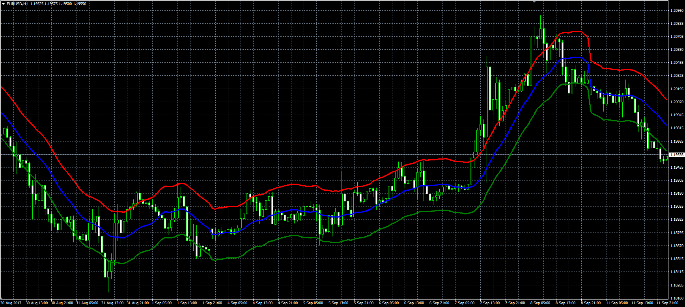

# Timed Moving Averages Envelope

> Source: https://fxcodebase.com/code/viewtopic.php?f=38&t=65081  
> Forum: 38 · Topic 65081 · 9 post(s)

---

## Timed Moving Averages Envelope

**Alexander.Gettinger** · Tue Sep 12, 2017 12:18 pm

Original LUA indicator: [viewtopic.php?f=17&t=63125](https://fxcodebase.com/code/viewtopic.php?f=17&t=63125)

 

Download:

 [Tick_Timed_Moving_Average_Envelope.mq4](files/114839/Tick_Timed_Moving_Average_Envelope.mq4)

---

## Re: Timed Moving Averages Envelope

**ForexGuy** · Wed Sep 13, 2017 6:26 am

The indicator's value cannot exceed a certain value. It should be able to accept small and large values. Could you please see what is the problem? Thanks.

---

## Re: Timed Moving Averages Envelope

**Apprentice** · Wed Sep 13, 2017 7:27 am

Can you give me an example?

---

## Re: Timed Moving Averages Envelope

**ForexGuy** · Wed Sep 13, 2017 8:18 am

> **Apprentice wrote:**
> Can you give me an example?

The maximum value (at which the indicator shows in the currency window) is 1300. Any higher values make the indicator disappear from the screen.

---

## Re: Timed Moving Averages Envelope

**Apprentice** · Sun Sep 17, 2017 6:15 am

Will investigate.
I suppose insufficient data is available.

---

## Re: Timed Moving Averages Envelope

**ForexGuy** · Sun Sep 17, 2017 1:24 pm

> **Apprentice wrote:**
> Will investigate.
> I suppose insufficient data is available.

Thank you for that! I will wait for your conclusion.

---

## Re: Timed Moving Averages Envelope

**oxbx99** · Sun Oct 01, 2017 5:15 am

hello,

the indicator doesnt work for big number,

I enter Duration: 5000 or 15000 , the indicator display nothing.

Please fix, thanks

---

## Re: Timed Moving Averages Envelope

**Alexander.Gettinger** · Mon Oct 02, 2017 11:48 am

> **oxbx99 wrote:**
> hello,
>
> the indicator doesnt work for big number,
>
> I enter Duration: 5000 or 15000 , the indicator display nothing.
>
> Please fix, thanks

What chart timeframe do you use?

---

## Re: Timed Moving Averages Envelope

**Alexander.Gettinger** · Mon Oct 02, 2017 11:50 am

> **ForexGuy wrote:**
> The indicator's value cannot exceed a certain value. It should be able to accept small and large values. Could you please see what is the problem? Thanks.

The big value of the period requires a big depth of loaded history.
