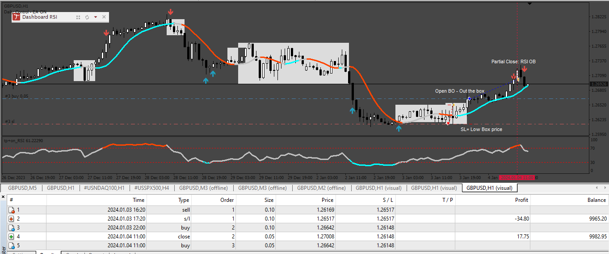

# TIPU_EA

> Source: https://fxcodebase.com/code/viewtopic.php?f=38&t=74801  
> Forum: 38 · Topic 74801 · 8 post(s)

---

## TIPU_EA

**Apprentice** · Mon Apr 22, 2024 11:38 am

Based on the request.
[https://fxcodebase.com/code/viewtopic.php?f=38&t=74777](https://fxcodebase.com/code/viewtopic.php?f=38&t=74777)

 [Tipu_Trend.ex4](files/155109/Tipu_Trend.ex4)

 [TIPU_EA.mq4](files/155109/TIPU_EA.mq4)

---

## Re: TIPU_EA

**trtrader** · Mon Apr 22, 2024 3:11 pm

Hi, I am using mac and getting this error. I have installed the indicator. but still the same.

2024.04.22 16:07:33.146	2023.08.01 00:00:00 TIPU_EA EURUSD,H1: Alert: THIS EA NEED AN INDICATOR\ninstall the file:\nTipu Trend\ninto the folder:\nMQL4/Indicators.

2024.04.22 16:07:33.145	2023.08.01 00:00:00 cannot load 'C:\Program Files (x86)\MetaTrader 4\MQL4\indicators\Tipu Trend.ex4'

2024.04.22 16:07:33.146	2023.08.01 00:00:00 TIPU_EA EURUSD,H1: initialization failed (1)

---

## Re: TIPU_EA

**Apprentice** · Sat Apr 27, 2024 3:03 am

Try it now.

---

## Re: TIPU_EA

**trtrader** · Sat Apr 27, 2024 8:04 am

still the same

2024.04.27 09:03:04.668	cannot load 'C:\Program Files (x86)\MetaTrader 4\MQL4\indicators\Tipu_Trend.ex4'

2024.04.27 09:01:52.662	2023.06.01 00:00:00 TIPU_EA fix EURUSD,H1: initialization failed (1)

2024.04.27 09:01:52.662	2023.06.01 00:00:00 TIPU_EA fix EURUSD,H1: Alert: THIS EA NEED AN INDICATOR\ninstall the file:\nTipu_Trend\ninto the folder:\nMQL4/Indicators.

---

## Re: TIPU_EA

**trtrader** · Sun Apr 28, 2024 2:47 pm

How about changing the source to market indicators?

---

## Re: TIPU_EA

**trtrader** · Mon May 27, 2024 4:15 pm

Hi,

I found someone to fix it for me. Finally working on my end. Could you please add to this version I attached:

--- Trailing stop, start, distance.
--- Breakeven

---

## Re: TIPU_EA

**Apprentice** · Tue May 28, 2024 4:45 am

We have added your request to the development list.
Development reference 426

---

## Re: TIPU_EA

**Apprentice** · Thu May 30, 2024 2:29 pm

for mac the unique difference I find was this:

string file_custom_indicator = "Market\\Tipu Trend";

 [Tipu_Trend_EA_final.mq4](files/155578/Tipu_Trend_EA_final.mq4)
