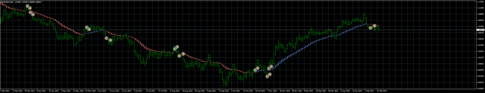

# TLN_EA

> Source: https://fxcodebase.com/code/viewtopic.php?f=38&t=73382  
> Forum: 38 · Topic 73382 · 9 post(s)

---

## TLN_EA

**Apprentice** · Wed Feb 15, 2023 3:17 pm

Based on the request.
[https://fxcodebase.com/code/viewtopic.php?f=27&p=149609](https://fxcodebase.com/code/viewtopic.php?f=27&p=149609)

 [TLN-indicator.mq4](files/149644/TLN-indicator.mq4)

 [TLN_EA_v1.00.mq4](files/149644/TLN_EA_v1.00.mq4)

---

## Re: TLN_EA

**Sensible** · Fri Feb 17, 2023 6:49 am

Hi Apprentice and the team of Fxcodebase,

I really appreciate the approving of this indicator and the development of the EA.

Please, I will like to include the below lists in the Trailing Stop Setup and BreakEven Setup:

**TrailingStop Setup:**

**Trailing Type:**No trailing
 Use traling in Pips
 Use trailing with ATR(start)
 High/Low of X bars
 Use trailing 10SMA
**TSL Initial step:**
**TSL Step:**
**TSL Distance:**

**BreakEven Setup:**

**BreakEven Type:**Do not use
 Set in %
 Set in Pips
 Set in $
 Set in % of Stoploss
 Set in Absolite Value(rate)
**BreakEven Trigger:**
**BreakEven Target:**

Apart from these corrections every other things is working fine. Help me ensure is working on both buy and sell side.

Thanks in advance.

---

## Re: TLN_EA

**Apprentice** · Wed Feb 22, 2023 3:13 am

We have added your request to the development list.
Development reference 169.

---

## Re: TLN_EA

**Apprentice** · Sun Mar 05, 2023 5:42 pm

Try this version.

 [TLN_EA_v1.10.mq4](files/149871/TLN_EA_v1.10.mq4)

---

## Re: TLN_EA

**puneet1979** · Fri Mar 10, 2023 7:02 am

Hi,

I am wondering if I am doing something wrong.
In almost all the EAs if we set stop loss by atr i get invalid sl error.
The tester and live both open buy orders but on sell orders i get error 130.
I am setring Ecn broker to false .
Any solutions or suggestions will ve appreciated highly.

Thanks

---

## Re: TLN_EA

**Apprentice** · Sat Mar 11, 2023 4:01 am

We have added your request to the development list.
Development reference 226.

---

## Re: TLN_EA

**puneet1979** · Sat Mar 18, 2023 3:39 am

Hi,

Have you been able to investigate and see why almost all the EAs behave like this meaning when we take stop loss with ATR no matter how high the multiplier is EA will not open SELL positions and give an error with invalid stop loss.

Thanks

---

## Re: TLN_EA

**puneet1979** · Fri Apr 07, 2023 8:22 am

Hi Apprentice,

Was your team able to look into this?

Thanks

---

## Re: TLN_EA

**Apprentice** · Tue Apr 18, 2023 1:13 pm

I can't reproduce any issue. Can I get a log file with details?
