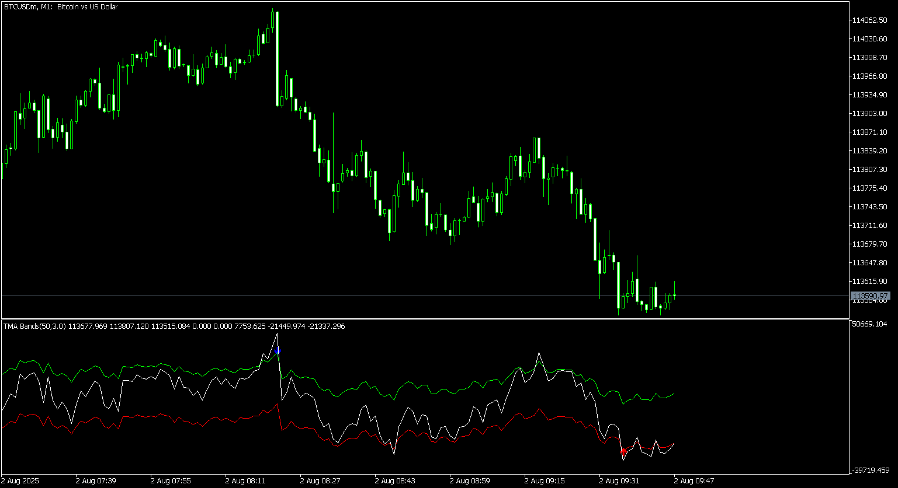

# TM555_(600+)_Alert_MT5

> Source: https://fxcodebase.com/code/viewtopic.php?f=38&t=76213  
> Forum: 38 · Topic 76213 · 6 post(s)

---

## TM555_(600+)_Alert_MT5

**Apprentice** · Mon Aug 04, 2025 3:54 am

Based on the request.
[https://fxcodebase.com/code/viewtopic.php?f=38&t=75944](https://fxcodebase.com/code/viewtopic.php?f=38&t=75944)

 [TM555_(600+)_Alert_MT5.mq5](files/160122/TM555_%28600%29_Alert_MT5.mq5)

---

## Re: TM555_(600+)_Alert_MT5

**tech42day** · Tue Aug 05, 2025 6:05 am

amazing work can you make arrow don't disappear ?

---

## Re: TM555_(600+)_Alert_MT5

**Apprentice** · Sun Aug 10, 2025 5:18 am

We have added your request to the development list.
Development reference 511

---

## Re: TM555_(600+)_Alert_MT5

**Apprentice** · Mon Aug 18, 2025 12:19 pm

[TM555_(600%2B)_Alert_MT5 NRP.mq5](files/160286/TM555_%286002B%29_Alert_MT5%20NRP.mq5)

Try this version.

---

## Re: TM555_(600+)_Alert_MT5

**khanatd** · Tue Sep 16, 2025 12:41 am

plz mt4 version too thanks

---

## Re: TM555_(600+)_Alert_MT5

**Apprentice** · Tue Sep 16, 2025 4:28 am

MT4 version.
[https://fxcodebase.com/code/viewtopic.php?f=38&t=75944](https://fxcodebase.com/code/viewtopic.php?f=38&t=75944)
