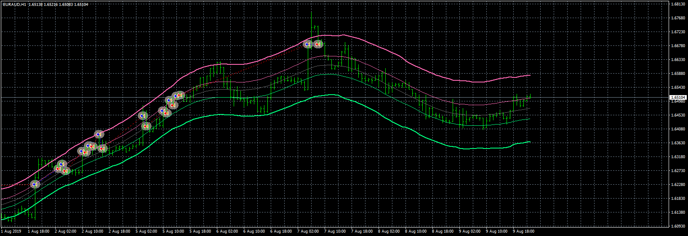

# TMA ATR Channel EA

> Source: https://fxcodebase.com/code/viewtopic.php?f=38&t=70261  
> Forum: 38 · Topic 70261 · 4 post(s)

---

## TMA ATR Channel EA

**Apprentice** · Wed Aug 05, 2020 4:58 am

Based on request.
[viewtopic.php?f=27&t=70251](https://fxcodebase.com/code/viewtopic.php?f=27&t=70251)

 [TMA ATR Channel.mq4](files/136611/TMA%20ATR%20Channel.mq4)

 [TMA ATR Channel EA.mq4](files/136611/TMA%20ATR%20Channel%20EA.mq4)

---

## Re: TMA ATR Channel EA

**Ultralinx** · Fri Aug 07, 2020 2:00 am

I've tested it a for a while, the results are random in a good ways.... However
1. The robot only open Buy, on the > high of the indikator (supposed to be on the lower )
2. When the ECN broker [true], the EA still buying on [iHigh] but also sell on the same area

---

## Re: TMA ATR Channel EA

**Apprentice** · Fri Aug 07, 2020 4:36 am

Your request is added to the development list.
Development reference 1848.

---

## Re: TMA ATR Channel EA

**Apprentice** · Tue Aug 11, 2020 5:23 am

already fixed.
