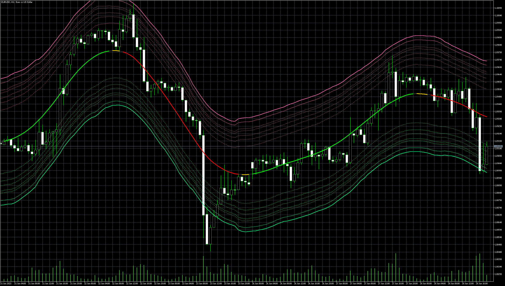

# TMA_ATR_Channel

> Source: https://fxcodebase.com/code/viewtopic.php?f=38&t=73883  
> Forum: 38 · Topic 73883 · 17 post(s)

---

## TMA_ATR_Channel

**Apprentice** · Wed Jun 28, 2023 11:33 am

Based on the request.
[https://fxcodebase.com/code/viewtopic.php?f=27&p=151302](https://fxcodebase.com/code/viewtopic.php?f=27&p=151302)

 [TMA_ATR_Channel.mq5](files/151448/TMA_ATR_Channel.mq5)

---

## Re: TMA_ATR_Channel

**[email protected]** · Sun Oct 29, 2023 10:26 am

Hello,

can you guys pls help me to build EA for this TMA ATR Channel MT5, The MQL4 EA was built before but I need MQL5 version of this EA.

thanks.

---

## Re: TMA_ATR_Channel

**lebarry** · Sat Nov 04, 2023 3:57 pm

Does the channel repaint ?

---

## Re: TMA_ATR_Channel

**Apprentice** · Fri Nov 10, 2023 3:21 pm

We have added your request to the development list.
Development reference 1008

---

## Re: TMA_ATR_Channel

**Apprentice** · Fri Nov 24, 2023 3:25 am

Try this version.

 [TMA_ATR_EA_v1.00.mq5](files/153389/TMA_ATR_EA_v1.00.mq5)

---

## Re: TMA_ATR_Channel

**rickCreations** · Sun Nov 26, 2023 8:56 am

Code: [Select all](https://fxcodebase.com/code/)
`2023.11.26 21:45:47.790   Core 01   2023.11.14 16:00:00   failed market buy 0.01 EURUSD [Unsupported filling mode]`

it is impossible to use this ea because it keeps saying filling mode unsupported (default settings)

your default settings just trying to change between the 3 settings that you said would stop this issue still no trades are placed.

please explain a little bit more how to optimize for Forex Pairs because all combinations i have tried in backtest optimization doesn't seem to take any trades.

---

## Re: TMA_ATR_Channel

**Apprentice** · Tue Nov 28, 2023 9:27 am

We have added your request to the development list.
Development reference 1008

---

## Re: TMA_ATR_Channel

**[email protected]** · Sun Dec 03, 2023 6:36 pm

> **Apprentice wrote:**
>
>
> Snimka zaslona 2023-11-24 092240.png
>
>
> Try this version.
>
>
> TMA_ATR_EA_v1.00.mq5

Dear Apprentice,
Thank you very much for this great work. These two problems can be seen in the EA version MT5 . Please fix them.
1- TP, SL and TSL are not activated for sell positions.
2- Immediately after the activation of SL or TP, the next position is opened in the same direction as the previous one. The opening of a new position should be conditional on changing the color of the TMA (red or green after yellow).

---

## Re: TMA_ATR_Channel

**[email protected]** · Mon Dec 04, 2023 7:08 pm

> **Apprentice wrote:**
>
>
> Snimka zaslona 2023-11-24 092240.png
>
>
> Try this version.
>
>
> TMA_ATR_EA_v1.00.mq5

Dear Apprentice

please add these options to the EA.
Choosing the channel level to enter the buy and sell positions. For example, add the option to open a buy position when TMA turns green and the remains green, if price touches the level of 0 or 1.618 or -2 or -3 of the channel enter the buy.
for a sell position when the TMA turns red and remains red. enter the Sell position if the price touches the level 0 or 1.618 or 2 or 3. levels must be chosen by user (in EA inputs). Also, add the option of "only buy" and "only sell" to the EA. thanks.

---

## Re: TMA_ATR_Channel

**Apprentice** · Tue Dec 05, 2023 6:54 am

We have added your request to the development list.
Development reference 1064

---

## Re: TMA_ATR_Channel

**Apprentice** · Wed Dec 13, 2023 3:52 pm

The filling mode is broker-specific.
Did You try all the 3 modes of the filling mode in the EA settings (No filling, Fill or Kill, Immediate or Cancel)?

---

## Re: TMA_ATR_Channel

**rickCreations** · Sun Dec 17, 2023 11:52 pm

> **Apprentice wrote:**
> The filling mode is broker-specific.
> Did You try all the 3 modes of the filling mode in the EA settings (No filling, Fill or Kill, Immediate or Cancel)?

Yes i tried all 3 modes on two different brokers

Afterprime
&
ICMarkets Raw

Both with the same results no trades in backtest.

---

## Re: TMA_ATR_Channel

**rickCreations** · Mon Dec 18, 2023 1:12 am

The variable "OrderFill" is not used in any of the mq5 EA code this is why we are having issues with it not working.

---

## Re: TMA_ATR_Channel

**Apprentice** · Tue Jan 16, 2024 12:54 pm

[TMA_ATR_EA_v1.20.mq5](files/154072/TMA_ATR_EA_v1.20.mq5)

Try this version.

---

## Re: TMA_ATR_Channel

**[email protected]** · Tue Jan 16, 2024 9:08 pm

> **Apprentice wrote:**
>
>
> TMA_ATR_EA_v1.20.mq5
>
>
> Try this version.

Hi. Please resolve the issues regarding the volume of positions for this version.
 In the EA test, there is a problem in the part of determining the volume of positions. Any volume specified by the user, the EA only considers the volume 0.001.
For this reason, no position is opened at all in most brokers (because the volume is less than 0.01). Other Position size setting options are not active and their selection has no effect. thank you.

---

## Re: TMA_ATR_Channel

**[email protected]** · Tue Jan 16, 2024 9:13 pm

pics volume.

---

## Re: TMA_ATR_Channel

**Apprentice** · Sat Jan 20, 2024 4:30 am

We have added your request to the development list.
Development reference 81
