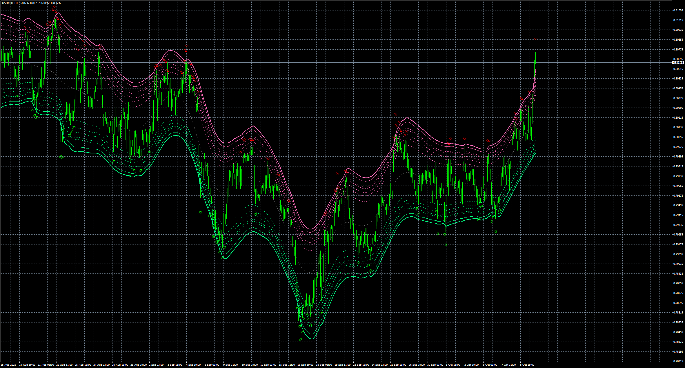

# TMA_CG_mladen_alerts_mtf_nrp

> Source: https://fxcodebase.com/code/viewtopic.php?f=38&t=76369  
> Forum: 38 · Topic 76369 · 4 post(s)

---

## TMA_CG_mladen_alerts_mtf_nrp

**Apprentice** · Sun Oct 12, 2025 2:06 am

Based on the request.
[https://fxcodebase.com/code/viewtopic.p ... 49#p160449](https://fxcodebase.com/code/viewtopic.php?f=27&p=160449#p160449)

 [TMA_CG_mladen_alerts_mtf_nrp.mq4](files/160855/TMA_CG_mladen_alerts_mtf_nrp.mq4)

---

## Re: TMA_CG_mladen_alerts_mtf_nrp

**Pensioner** · Mon Oct 13, 2025 3:51 am

Thank you, dear colleague! I'll test it.

---

## Re: TMA_CG_mladen_alerts_mtf_nrp

**Pensioner** · Mon Oct 13, 2025 7:15 am

a big redraw remains!!

---

## Re: TMA_CG_mladen_alerts_mtf_nrp

**khanatd** · Tue Oct 21, 2025 9:48 pm

hi sir plz add mt4 non repaint arrows at close of current candle or reversals/continuations /breakouts etc

thanks
khan
