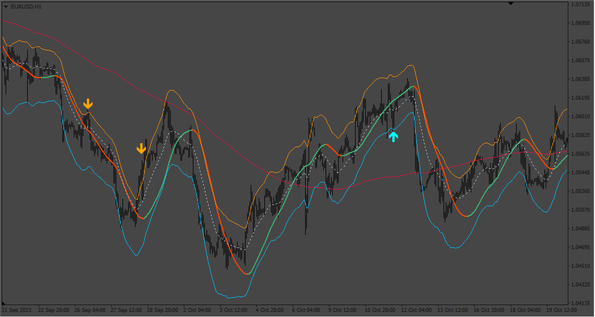

# TMA_CG

> Source: https://fxcodebase.com/code/viewtopic.php?f=38&t=74096  
> Forum: 38 · Topic 74096 · 5 post(s)

---

## TMA_CG

**Apprentice** · Wed Aug 30, 2023 12:25 pm

Based on the request.
[https://fxcodebase.com/code/viewtopic.php?f=38&t=74058](https://fxcodebase.com/code/viewtopic.php?f=38&t=74058)

 [TMA_CG.mq4](files/152307/TMA_CG.mq4)

---

## Re: TMA_CG

**inver61** · Sun Sep 03, 2023 5:40 am

ok, perfect, that's what I wanted, thank you very much.

---

## Re: TMA_CG

**inver61** · Sat Oct 07, 2023 11:31 am

Hello friends. I would like you to add to the previous TMA_CG indicator, in addition to the average it already has, also the HMA indicator as a filter, where it would only show the arrow, if the color of the arrow of the TMA indicator matches the color of the HMA indicator. That is to say, it would filter and only mark the arrows with the same trend, if the HMA indicator is green and the red TMA arrow it would not show it, on the other hand, if it is HMA green and the TMA arrow green it would show it, (Like the photos) . Thank you very much for your work.

---

## Re: TMA_CG

**Apprentice** · Thu Oct 12, 2023 3:59 am

We have added your request to the development list.
Development reference 920

---

## Re: TMA_CG

**Apprentice** · Sun Dec 10, 2023 4:01 am

 [Hull.mq4](files/153630/Hull.mq4)

 [TMA_CG_v3.mq4](files/153630/TMA_CG_v3.mq4)
