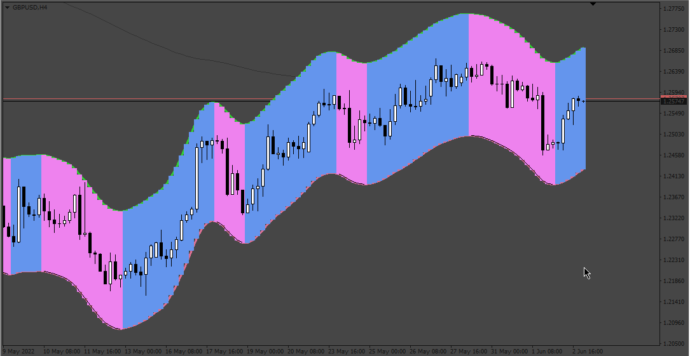
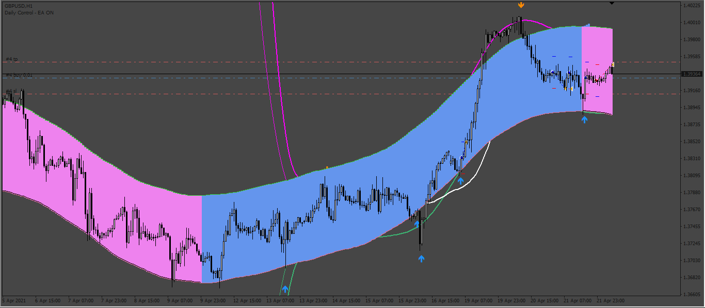

# TMA_slope_bands

> Source: https://fxcodebase.com/code/viewtopic.php?f=38&t=72342  
> Forum: 38 · Topic 72342 · 7 post(s)

---

## TMA_slope_bands

**Apprentice** · Mon Jun 06, 2022 9:13 am

Based on the request.
[https://fxcodebase.com/code/viewtopic.php?f=27&p=145702](https://fxcodebase.com/code/viewtopic.php?f=27&p=145702)

 [TMA_slope_bands.mq4](files/146283/TMA_slope_bands.mq4)

 [TMA_slope_bands.mq5](files/146283/TMA_slope_bands.mq5)

---

## Re: TMA_slope_bands

**Apprentice** · Fri Jun 17, 2022 2:18 am

TMA_slope_bands.mq5 added.

---

## Re: TMA_slope_bands

**mozart13** · Sun Jun 19, 2022 6:39 pm

could you please make EA with 2 indicator's, TMA_slope_bands and TMA_Centered_H1_V3.
Use arrows of TMA_Centered_H1_V3 (arrow-8 buy, arrow-7 to sell) to buy and sell as per TMA_slope_bands trend( blue-buy, violet-sell).
thank you !

---

## Re: TMA_slope_bands

**Apprentice** · Mon Jun 20, 2022 11:22 am

We have added your request to the development list.
Development reference 365.

---

## Re: TMA_slope_bands

**Apprentice** · Wed Jun 29, 2022 3:44 am

 [TMA_Centered_H1.ex4](files/146544/TMA_Centered_H1.ex4)

 [TMA_slope_bands.mq4](files/146544/TMA_slope_bands.mq4)

 [Slope_and_Centered EA.mq4](files/146544/Slope_and_Centered%20EA.mq4)

---

## Re: TMA_slope_bands

**mozart13** · Fri Jul 01, 2022 5:24 pm

thx,
if you could fix couple of things please, buy buffer for TMA slope is 6-buy, 8-sell, that's easy one, difficult one is settings of TMA_Centered_H1, it's not reading correctly, regardless what values you put in first 3 spot's in EA settings, even if you manipulate them around still shows 0 for first 3 spots for indicator .
thank you !

---

## Re: TMA_slope_bands

**Apprentice** · Sun Jul 03, 2022 4:57 am

We have added your request to the development list.
Development reference 398.
