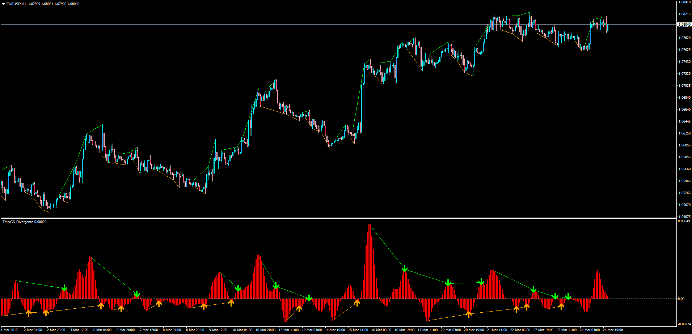

# TMACD Divergence

> Source: https://fxcodebase.com/code/viewtopic.php?f=38&t=64547  
> Forum: 38 · Topic 64547 · 4 post(s)

---

## TMACD Divergence

**Apprentice** · Sun Mar 26, 2017 6:02 am

LUA Original: [viewtopic.php?f=17&t=2190](https://fxcodebase.com/code/viewtopic.php?f=17&t=2190)

Description:

MT4 version of the LUA Original "TMACD Divergence". This indicator will compare the Highs and Lows to find divergence with the maximum and minimum values of the TMACD oscillator.

 [TMACD_Divergence.mq4](files/111687/TMACD_Divergence.mq4)

---

## Re: TMACD Divergence

**thirstydaniel** · Fri Mar 31, 2017 10:48 pm

Does it push notification please ?
Thank you

---

## Re: TMACD Divergence

**thirstydaniel** · Fri Mar 31, 2017 10:59 pm

Does it have push notification feature please ? Thank you

---

## Re: TMACD Divergence

**Apprentice** · Wed Apr 05, 2017 3:49 pm

No we can add it.

Your request is added to the development list, Under Id Number 3773
 If someone is interested to do this task, please contact me.
