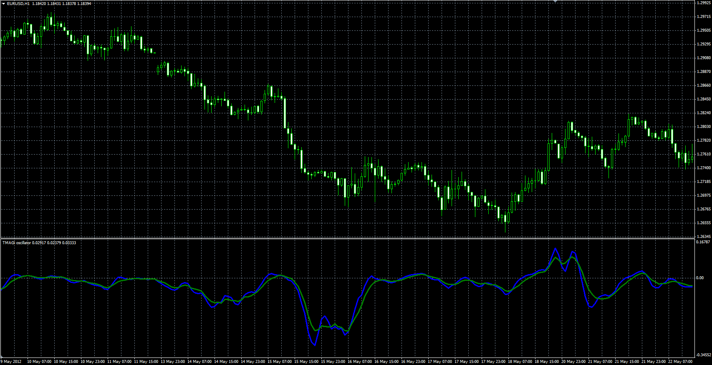

# TMAGi oscillator

> Source: https://fxcodebase.com/code/viewtopic.php?f=38&t=61695  
> Forum: 38 · Topic 61695 · 1 post(s)

---

## TMAGi oscillator

**Alexander.Gettinger** · Fri Jan 09, 2015 4:19 pm

TMAGi is an oscillator based on 3 Moving Averages.

TMAGi formula is:
Buff[i]=Abs(MVA_Slow-MVA_Middle)+Abs(MVA_Slow-MVA_Fast)+Abs(MVA_Fast-MVA_Middle);
TMAGi1[i]=MVA(Buff) for last SlowingSMA periods before i
TMAGi2[i]=LWMA(Buff) for SlowingLWMA periods before i.

 

Download:

 [TMAGi.mq4](files/98065/TMAGi.mq4)
