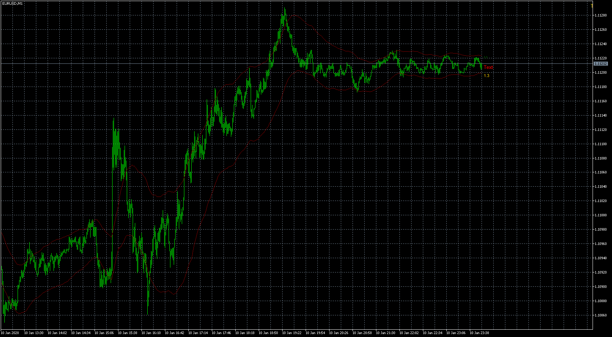
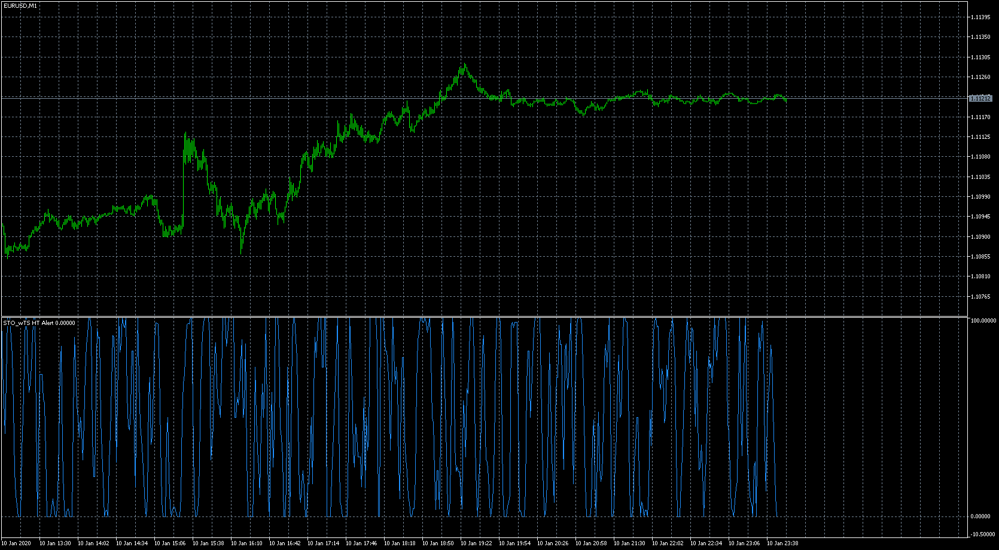
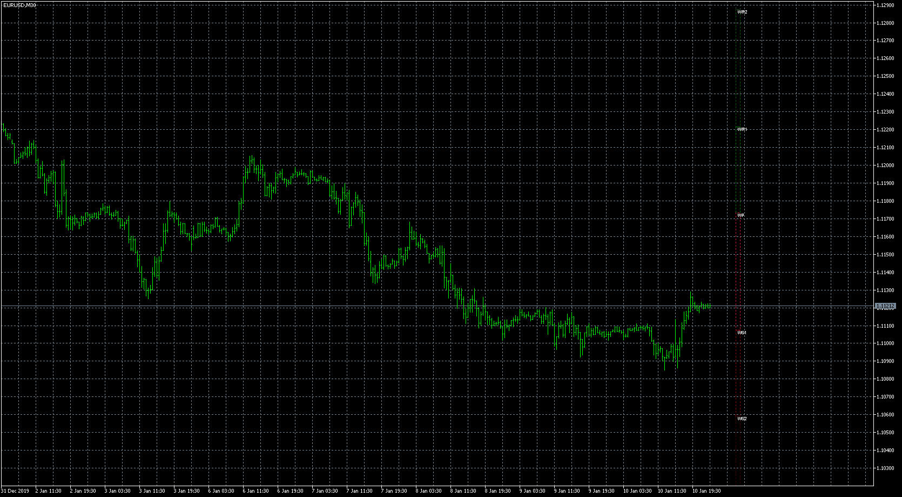
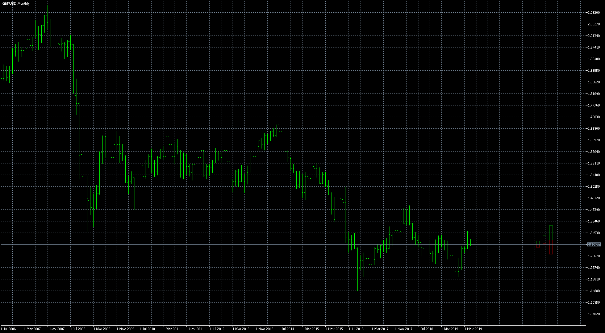
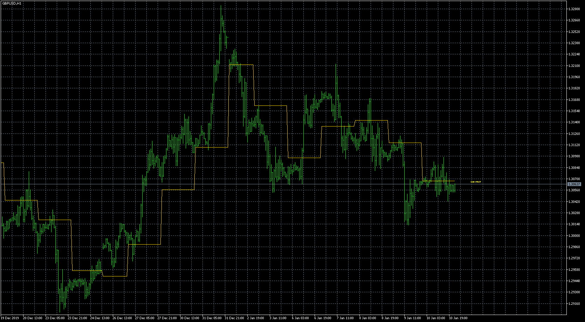
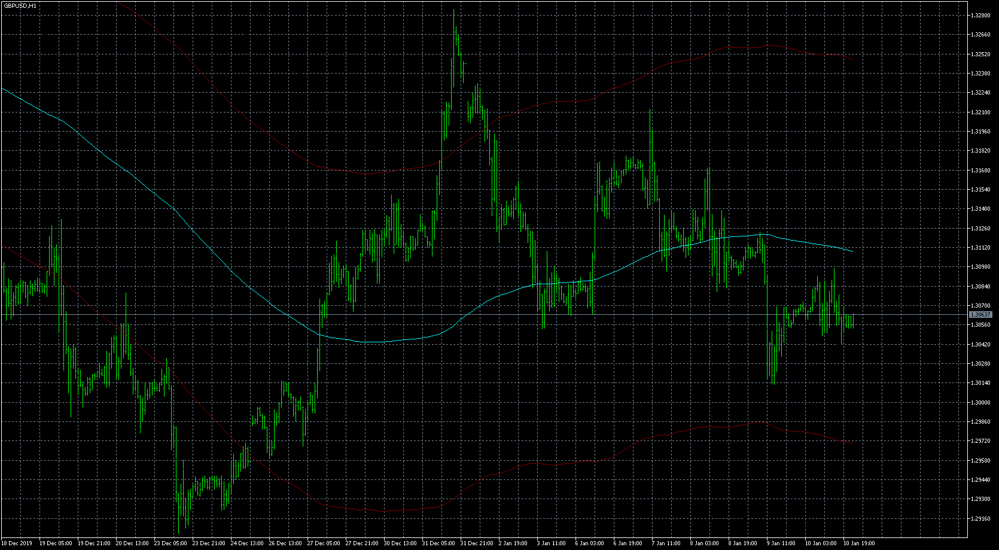

# TmaTrue_3.0_with_Distances

> Source: https://fxcodebase.com/code/viewtopic.php?f=38&t=69307  
> Forum: 38 · Topic 69307 · 9 post(s)

---

## TmaTrue_3.0_with_Distances

**Apprentice** · Sat Jan 11, 2020 7:55 am

Based on request.
[viewtopic.php?f=27&t=69291](https://fxcodebase.com/code/viewtopic.php?f=27&t=69291)

 [TmaTrue_2.0_with_Distances_6xx.mq5](files/130680/TmaTrue_2.0_with_Distances_6xx.mq5)

 [TmaTrue_3.0_with_Distances_6xx.mq5](files/130680/TmaTrue_3.0_with_Distances_6xx.mq5)

---

## STO_wTS__HT_ALERT

**Apprentice** · Sat Jan 11, 2020 7:59 am

 [10.7_3.23STO_wTS__HT_ALERT.mq5](files/130682/10.7_3.23STO_wTS__HT_ALERT.mq5)

 [10.9_3.26STO_wTS__HT_ALERT.mq5](files/130682/10.9_3.26STO_wTS__HT_ALERT.mq5)

---

## PivotBoxes

**Apprentice** · Sat Jan 11, 2020 8:04 am

 [10.9v1.0_PivotBoxes.mq5](files/130683/10.9v1.0_PivotBoxes.mq5)

---

## DWM_OPEN_BAR

**Apprentice** · Sat Jan 11, 2020 8:15 am

 [10.9_v.1.0_DWM_OPEN_BAR.mq5](files/130684/10.9_v.1.0_DWM_OPEN_BAR.mq5)

---

## INDI_DP

**Apprentice** · Sat Jan 11, 2020 8:17 am

 [10.7_INDI_DP.mq5](files/130685/10.7_INDI_DP.mq5)

---

## ATR_CHANNELS

**Apprentice** · Sat Jan 11, 2020 8:19 am

 [10.7_60_ATR_CHANNELS.mq5](files/130686/10.7_60_ATR_CHANNELS.mq5)

---

## Re: TmaTrue_3.0_with_Distances

**Apprentice** · Tue Jan 14, 2020 5:47 am

 [10.7_LINE_OF_ZERO.mq5](files/130720/10.7_LINE_OF_ZERO.mq5)

---

## Re: TmaTrue_3.0_with_Distances

**hoichoi** · Wed Apr 08, 2020 7:37 am

can anyone post mt4 version please?
thanks

---

## Re: TmaTrue_3.0_with_Distances

**Apprentice** · Thu Apr 09, 2020 5:06 am

You can find MT4 versions in Collection.zip
[viewtopic.php?f=27&t=69291](https://fxcodebase.com/code/viewtopic.php?f=27&t=69291)
