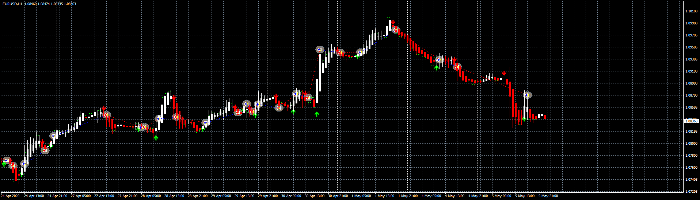
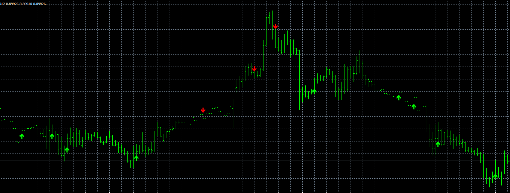

# TMS_Arrows

> Source: https://fxcodebase.com/code/viewtopic.php?f=38&t=63678  
> Forum: 38 · Topic 63678 · 25 post(s)

---

## TMS_Arrows

**Apprentice** · Sun Jul 17, 2016 4:14 am

Based on request.
[viewtopic.php?f=27&t=63642](https://fxcodebase.com/code/viewtopic.php?f=27&t=63642)
Green Arrow Signal
TDI green line crosses red line from below
Stochastic moving upwards
Heiken Ashi 1st or 2nd candle bullish

Red Arrow Signal
TDI green line crosses red line from above
Stochastic moving downwards
Heiken Ashi 1st or 2nd candle bearish

 [#TMS_Arrows.mq4](files/107160/TMS_Arrows.mq4)

TS2/Lua version.
[viewtopic.php?f=17&t=70728](https://fxcodebase.com/code/viewtopic.php?f=17&t=70728)

---

## Re: TMS_Arrows

**Itssiisi** · Sun Jul 17, 2016 4:37 am

Thank You Apprentice I really appreciate it

---

## Re: TMS_Arrows

**Artem.dev** · Fri Oct 12, 2018 1:50 am

Hi. Where to find the indicator TDI?

---

## Re: TMS_Arrows

**Apprentice** · Fri Oct 12, 2018 3:48 am

Here
[viewtopic.php?f=27&t=63642](https://fxcodebase.com/code/viewtopic.php?f=27&t=63642)

---

## Re: TMS_Arrows

**Artem.dev** · Fri Oct 12, 2018 10:37 pm

> **Apprentice wrote:**
> Here
> [viewtopic.php?f=27&t=63642](https://fxcodebase.com/code/viewtopic.php?f=27&t=63642)

Thank you!

---

## Re: TMS_Arrows

**ericcky** · Fri Aug 14, 2020 5:53 am

Hi Apprentice Sir,

Can you please convert this into a MT4 version and add in auto trade functions so it can be an EA?

Also can I have the indicators need for MT4?

Take your time and thank you for helping.

---

## Re: TMS_Arrows

**Apprentice** · Mon Aug 17, 2020 3:33 am

Your request is added to the development list.
Development reference 1891.

---

## Re: TMS_Arrows

**Apprentice** · Thu Aug 20, 2020 8:14 am

 [TMS_Arrows_EA.mq4](files/136959/TMS_Arrows_EA.mq4)

 [Heiken Ashi.mq4](files/136959/Heiken%20Ashi.mq4)

Try this version.

---

## Re: TMS_Arrows

**ericcky** · Tue Sep 15, 2020 8:20 am

Hi Apprentice and team,

Does this ea it self contains the indicator to auto trade or do I need paste all three indi (TMS ARROW, TDI and HA)?

I'm asking this because I only put the EA in the expert folder and HA in the indicator folder and it ran without errors. So was wondering if i am running the EA without full indicators or not.

Thank you for your help.

---

## Re: TMS_Arrows

**Apprentice** · Wed Sep 16, 2020 11:05 am

Only #TMS_Arrows.mq4 is needed.

---

## Re: TMS_Arrows

**omgepe** · Sat Dec 12, 2020 10:05 pm

hi Apprentice,

could you convert this TMS Arrow EA strategy to lua?

thanks

gp

---

## Re: TMS_Arrows

**Apprentice** · Sun Dec 13, 2020 1:58 pm

Your request is added to the development list.
Development reference 2453.

---

## Re: TMS_Arrows

**Apprentice** · Wed Dec 16, 2020 10:23 am

Try this version.
[viewtopic.php?f=31&t=70727](https://fxcodebase.com/code/viewtopic.php?f=31&t=70727)

---

## Re: TMS_Arrows

**foxytrader** · Sat Dec 19, 2020 1:48 am

To reduce the false signal , is it possible to make the signal appears if price has closed above or below 5EMA? like the original TMS from Eric?

---

## Re: TMS_Arrows

**Apprentice** · Sat Dec 19, 2020 5:12 am

Your request is added to the development list.
Development reference 2503.

---

## Re: TMS_Arrows

**foxytrader** · Sat Dec 19, 2020 10:04 am

And is it possible to update the EA with the more advanced SL,TP & trailing SL like the other EAs?

Thanks

---

## Re: TMS_Arrows

**Apprentice** · Wed Dec 23, 2020 3:13 am

[#TMS_Arrows.mq4](files/139750/TMS_Arrows.mq4)

Try this version.

---

## Re: TMS_Arrows

**foxytrader** · Wed Dec 23, 2020 7:45 am

The arrows don't even appear at all using 5 SMA setting.

[https://ibb.co/kxcrZMV](https://ibb.co/kxcrZMV)

---

## Re: TMS_Arrows

**Apprentice** · Thu Dec 24, 2020 6:34 am

Your request is added to the development list.
Development reference 2524.

---

## Re: TMS_Arrows

**Apprentice** · Fri Dec 25, 2020 4:49 am

I don't have any issues. Check your parameters
Can you provide them?

---

## Re: TMS_Arrows

**foxytrader** · Fri Dec 25, 2020 11:03 pm

Hi,

Sorry I didn't make myself clear. in the previous post.

[https://ibb.co/HdD9NYc](https://ibb.co/HdD9NYc)

Please refer to the link above

Buy signal should appear once HA candle crosses over 5EMA & we have an upward TDI cross (green crossing red) & sell signal should appear once HA candle crosses below 5EMA & TDI cross downward.

Thanks.

---

## Re: TMS_Arrows

**Apprentice** · Sat Dec 26, 2020 5:02 am

Should these crosses be simultaneous?
On the same candle.
Or for oscillator will suffice if in the same direction.

---

## Re: TMS_Arrows

**ARREFAMM** · Fri Mar 19, 2021 9:19 am

Can you add percent auto lot pleas

---

## Re: TMS_Arrows

**Apprentice** · Sat Mar 20, 2021 4:16 am

Your request is added to the development list.
Development reference 299.

---

## Re: TMS_Arrows

**Apprentice** · Mon Mar 22, 2021 4:35 am

[TMS_Arrows_EA.mq4](files/141293/TMS_Arrows_EA.mq4)

Try this version.
