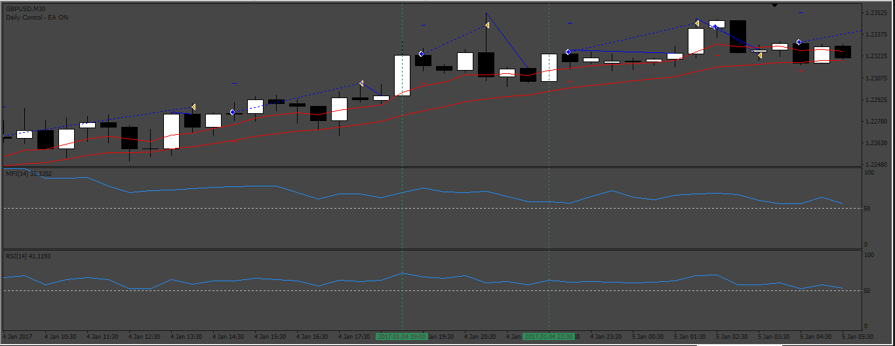
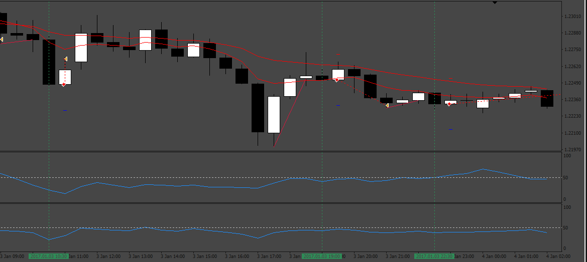

# TMT_Scalping EA

> Source: https://fxcodebase.com/code/viewtopic.php?f=38&t=73273  
> Forum: 38 · Topic 73273 · 6 post(s)

---

## TMT_Scalping EA

**Apprentice** · Thu Jan 26, 2023 5:11 am

 

Based on the request.
[https://fxcodebase.com/code/viewtopic.php?f=27&p=14924](https://fxcodebase.com/code/viewtopic.php?f=27&p=14924)

 [TMT_Scalping EA.mq4](files/149300/TMT_Scalping%20EA.mq4)

---

## Re: TMT_Scalping EA

**Steve Hoang** · Mon Feb 13, 2023 3:31 pm

Hi Apprentice
The EA working good but but just to be safe I have a little bit change about the rules

**Buy Rules**
1. Check higher timeframe (D1). Buy if bullish candle
2. RSI is above 50 and below 80
3. MFI is above 50 and below 80

**Sell Rules**
1. Check higher timeframe (D1). Sell if bearish candle
2. RSI Filter is below 50 and above 20
3. MFI Meter is below 50 and above 20

---

## Re: TMT_Scalping EA

**Apprentice** · Wed Feb 15, 2023 3:15 am

We have added your request to the development list.
Development reference 152.

---

## Re: TMT_Scalping EA

**Apprentice** · Wed Feb 15, 2023 3:13 pm

[TMT_Scalping_EA.mq4](files/149643/TMT_Scalping_EA.mq4)

Try this version.

---

## Re: TMT_Scalping EA

**xmohammad** · Sat Feb 25, 2023 9:34 am

> **Apprentice wrote:**
>
>
> TMT_Scalping_EA.mq4
>
>
> Try this version.

Please Add:
- If the previous position loses, the next position should enter with 2 times the previous volume (martingale On)
-MAX_TRADES_AT_SAME_TIME XX
-The bot stops working after X wins per day Start again from next day

---

## Re: TMT_Scalping EA

**Apprentice** · Tue Feb 28, 2023 4:04 am

We have added your request to the development list.
Development reference 185.
