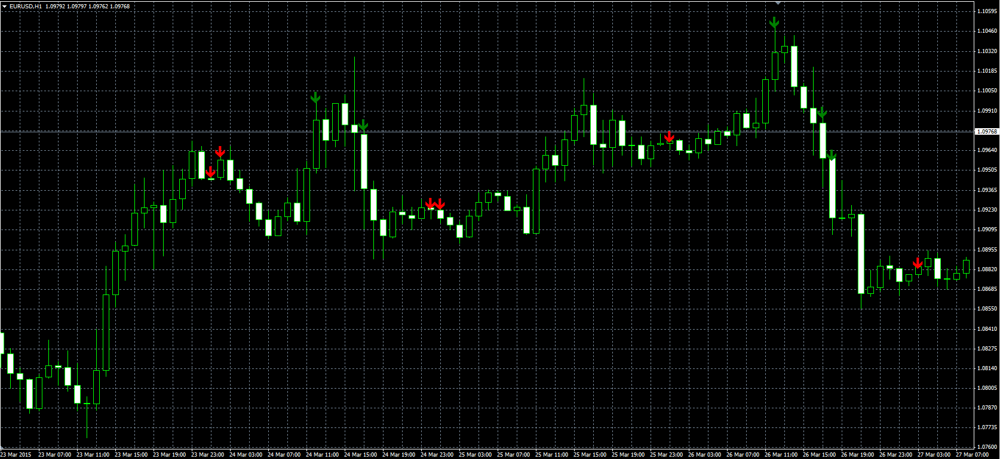

# Toby Crabel NR Pattern

> Source: https://fxcodebase.com/code/viewtopic.php?f=38&t=62169  
> Forum: 38 · Topic 62169 · 1 post(s)

---

## Toby Crabel NR Pattern

**Alexander.Gettinger** · Thu Apr 30, 2015 10:01 am

Original LUA indicator: [viewtopic.php?f=17&t=61080](https://fxcodebase.com/code/viewtopic.php?f=17&t=61080).

> According to Toby Crabel:
> 2NR is the narrowest range from high to low of any 2-day period relative to any 2-day period within previous 20 days
> 3NR is the narrowest range from high to low of any 3-day period relative to any 3-day period within previous 20 days
> 4NR is the narrowest range from high to low of any 4-day period relative to any 4-day period within previous 40 days
> 8NR is the narrowest range from high to low of any 8-day period relative to any 8-day period within previous 40 days

 

Download:

 [Toby_Crabel_NR_Pattern.mq4](files/100174/Toby_Crabel_NR_Pattern.mq4)
