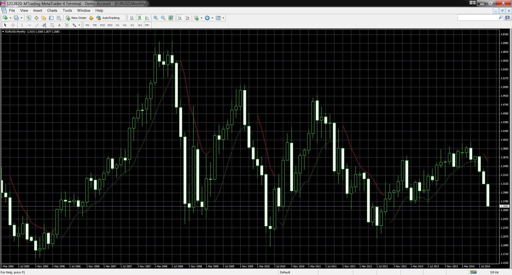

# Tom Demark Moving Average

> Source: https://fxcodebase.com/code/viewtopic.php?f=38&t=61279  
> Forum: 38 · Topic 61279 · 1 post(s)

---

## Tom Demark Moving Average

**Apprentice** · Sun Sep 28, 2014 10:46 am

Original LUA indicator:[http://fxcodebase.com/code/viewtopic.php?f=17&t=61278](https://fxcodebase.com/code/viewtopic.php?f=17&t=61278)

As described in Demark Indicators, page 145 by Jason Perl.

Logic - helps in identifying uptrend / downtrend.

1. Identify a prospective bullish trend first:
If price low > 12 prior lows, then selling pressure easing.

2. Plot bullish TD MA once condition (1) is satisfied where

TD MA = 5 bars MA of lows & extends it for another 4 bars
(ie. current price bar & 3 more into future).

And if within the next 4 bars & the market does record a low greater than all 12 previous lows, then the 5-bar MA will continue for another 4 bars.

Otherwise, the MA is not plotted.

 [Tom Demark Moving Average.mq4](files/96254/Tom%20Demark%20Moving%20Average.mq4)
