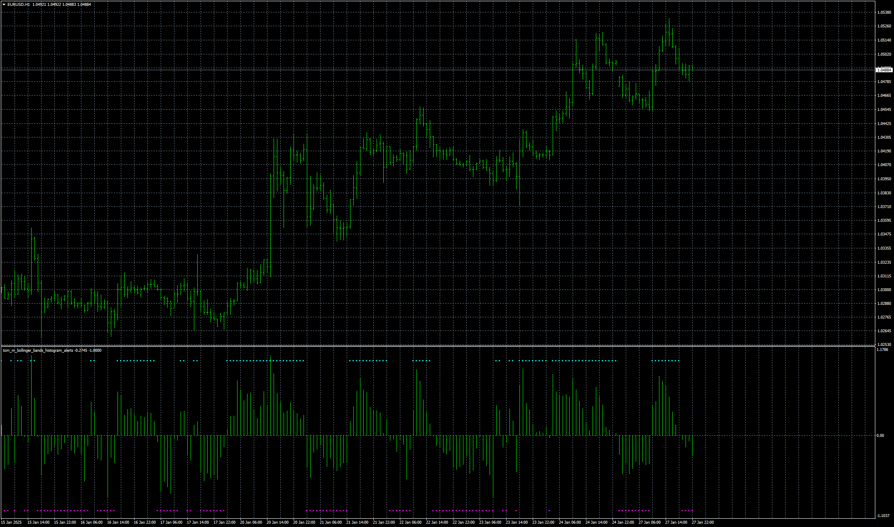

# tom_m_bollinger_bands_histogram_alerts

> Source: https://fxcodebase.com/code/viewtopic.php?f=38&t=75559  
> Forum: 38 · Topic 75559 · 4 post(s)

---

## tom_m_bollinger_bands_histogram_alerts

**Apprentice** · Mon Jan 27, 2025 3:05 pm

Based on the request.
[https://fxcodebase.com/code/viewtopic.php?f=38&t=75528](https://fxcodebase.com/code/viewtopic.php?f=38&t=75528)

 [tom_m_bollinger_bands_histogram_alerts.mq4](files/158040/tom_m_bollinger_bands_histogram_alerts.mq4)

---

## Re: tom_m_bollinger_bands_histogram_alerts

**Honest_Trader** · Thu Feb 13, 2025 9:01 am

Thanks mate, but checked it right now. No alerts are popping up. Do check when you have time.

Cheers
GK

---

## Re: tom_m_bollinger_bands_histogram_alerts

**Apprentice** · Mon Feb 17, 2025 1:43 pm

We have added your request to the development list.
Development reference 128

---

## Re: tom_m_bollinger_bands_histogram_alerts

**Apprentice** · Wed Feb 19, 2025 6:44 am

[tom_m_bollinger_bands_histogram_alerts_v2.mq4](files/158308/tom_m_bollinger_bands_histogram_alerts_v2.mq4)

Try this version.
