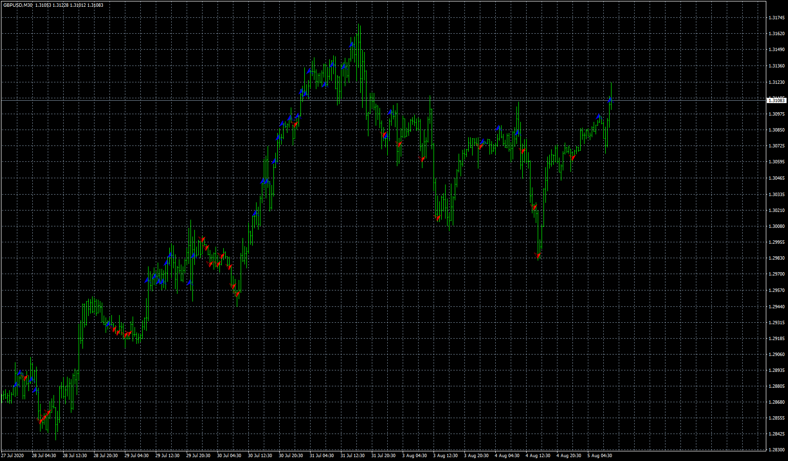

# Tomoso_Arrow

> Source: https://fxcodebase.com/code/viewtopic.php?f=38&t=71195  
> Forum: 38 · Topic 71195 · 4 post(s)

---

## Tomoso_Arrow

**Apprentice** · Sun May 16, 2021 3:10 am

Based on the request.
[https://fxcodebase.com/code/viewtopic.p ... 03#p141003](https://fxcodebase.com/code/viewtopic.php?f=27&p=141003#p141003)

 [Tomoso_Arrow.mq4](files/142110/Tomoso_Arrow.mq4)

---

## Re: Tomoso_Arrow

**Momomi** · Sun Nov 14, 2021 2:06 am

Hi, how do I get this to work in H1 & H4?
I tried but the arrows won't show up in these 2 timeframes. The rest of the timeframes work.

---

## Re: Tomoso_Arrow

**Apprentice** · Mon Nov 15, 2021 4:09 am

Your request is added to the development list.
Development reference 989.

---

## Re: Tomoso_Arrow

**Apprentice** · Thu Nov 25, 2021 10:36 am

I don't have any issues
