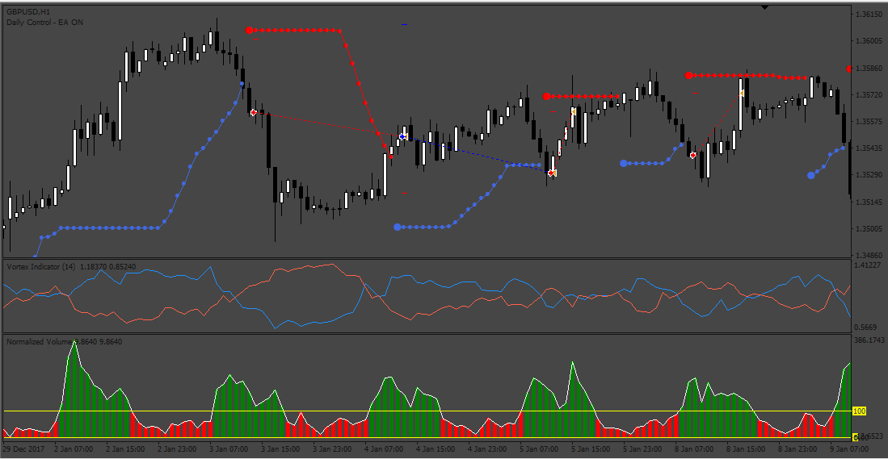
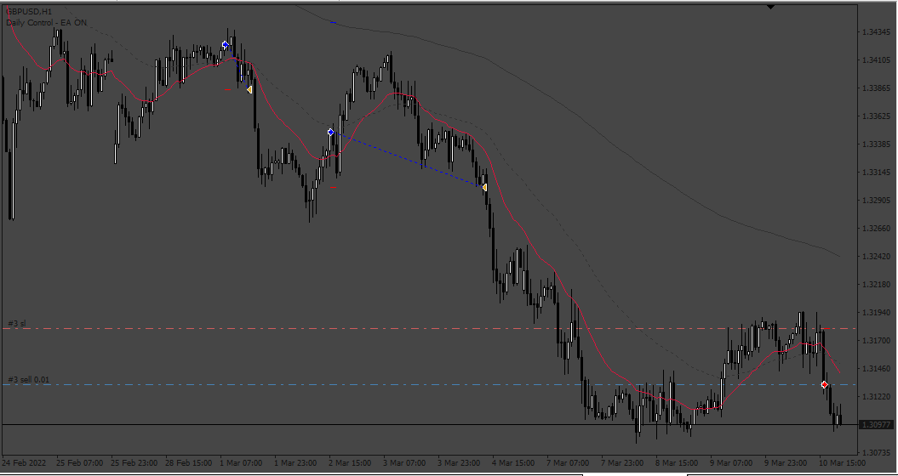
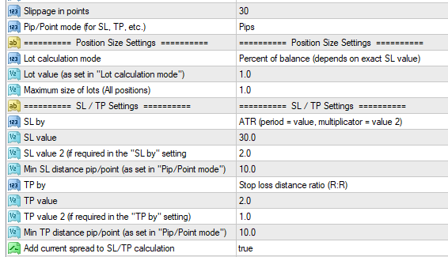

# Top_Trend_Vortex_EA

> Source: https://fxcodebase.com/code/viewtopic.php?f=38&t=73475  
> Forum: 38 · Topic 73475 · 3 post(s)

---

## Top_Trend_Vortex_EA

**Apprentice** · Sat Mar 11, 2023 3:15 am

Based on the request.
[https://fxcodebase.com/code/viewtopic.php?f=38&t=73450](https://fxcodebase.com/code/viewtopic.php?f=38&t=73450)

 [Normalized_Volume.ex4](files/149946/Normalized_Volume.ex4)

 [TOPTREND.ex4](files/149946/TOPTREND.ex4)

 [vortex-indicator.ex4](files/149946/vortex-indicator.ex4)

 [Top_Trend_Vortex_EA.mq4](files/149946/Top_Trend_Vortex_EA.mq4)

---

## Re: Top_Trend_Vortex_EA

**puneet1979** · Mon Sep 25, 2023 12:12 am

Hi,

So far so good the EA is working fine but I have a question and nobody could answer this .
For example if EA opens a 2 lot position and then I close 1 lot manually/partially on MT4 will ea still close the remaining position as per its configuration or will it mess up with the parameters thus making the EA unable to close the remaining position.

Thanks

---

## Re: Top_Trend_Vortex_EA

**Apprentice** · Sat Feb 10, 2024 11:05 am

 

 [Top_Trend_Vortex_EA_v2.mq4](files/154337/Top_Trend_Vortex_EA_v2.mq4)

 [EMA_STOCH_JEAW_EA_v1.00.mq4](files/154337/EMA_STOCH_JEAW_EA_v1.00.mq4)
