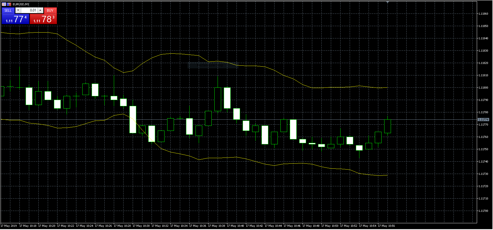

# toptahlil_Bollinger_and_ATR_Band (MQ5)

> Source: https://fxcodebase.com/code/viewtopic.php?f=38&t=68471  
> Forum: 38 · Topic 68471 · 6 post(s)

---

## toptahlil_Bollinger_and_ATR_Band (MQ5)

**Apprentice** · Fri May 17, 2019 4:53 am

Based on request.
[viewtopic.php?f=27&t=68398](https://fxcodebase.com/code/viewtopic.php?f=27&t=68398)

 [toptahlil_Bollinger_and_ATR_Band.mq5](files/126371/toptahlil_Bollinger_and_ATR_Band.mq5)

---

## Re: toptahlil_Bollinger_and_ATR_Band (MQ5)

**Sp2562** · Mon May 20, 2019 10:42 am

Perfect thank you.

---

## Re: toptahlil_Bollinger_and_ATR_Band (MQ5)

**Sp2562** · Tue May 21, 2019 7:32 am

Hello friends. Please make the following adjustments in this indicator.

1º Place arrow when the candle passes the band above and below.

2º Place sound alert

---

## Re: toptahlil_Bollinger_and_ATR_Band (MQ5)

**Apprentice** · Sat May 25, 2019 3:09 am

Your request is added to the development list under Id Number 4679

---

## Re: toptahlil_Bollinger_and_ATR_Band (MQ5)

**Apprentice** · Wed May 29, 2019 3:50 am

[toptahlil_Bollinger_and_ATR_Band.mq5](files/126602/toptahlil_Bollinger_and_ATR_Band.mq5)

Try this version.

---

## Re: toptahlil_Bollinger_and_ATR_Band (MQ5)

**Sp2562** · Thu May 30, 2019 10:59 am

Perfect, thank you.
