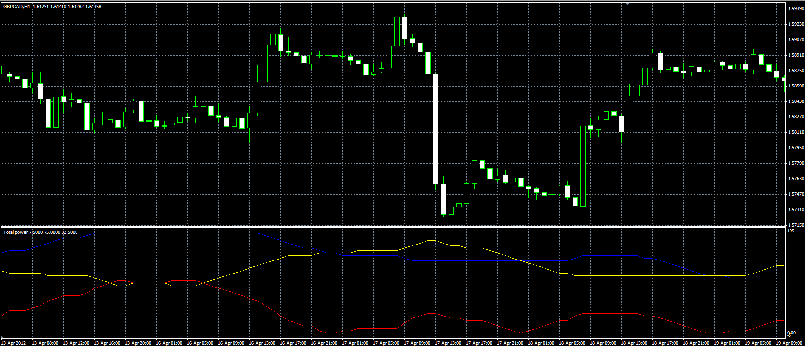

# Total Power Indicator

> Source: https://fxcodebase.com/code/viewtopic.php?f=38&t=17980  
> Forum: 38 · Topic 17980 · 2 post(s)

---

## Total Power Indicator

**Alexander.Gettinger** · Tue May 08, 2012 5:02 pm

Original indicator: [viewtopic.php?f=17&t=6307&p=31219](https://fxcodebase.com/code/viewtopic.php?f=17&t=6307&p=31219)

> Total Power Indicator or Improving Elder Ray Indicator
>
>
> Power = Abs (BearCount - BullCount)*100 / Lookback Period;
> BearPower = BearCount*100/ Lookback Period;
> BullPower = BullCount*100/Lookback Period ;
>
> The components of this indicator we get, if we count the Elder Ray Indicator components Within the Lookback Period.
>
> But only if Elder Ray Bull is greater than 0,
> and Elder Ray Bear is less than 0

 

Download:

 [Total_Power.mq4](files/32535/Total_Power.mq4)

---

## Re: Total Power Indicator

**Apprentice** · Fri Jan 20, 2017 5:38 am

Indicator was revised and updated.
