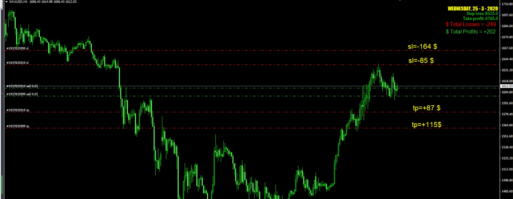
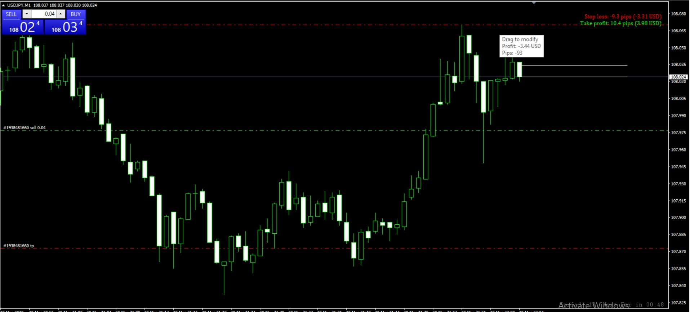
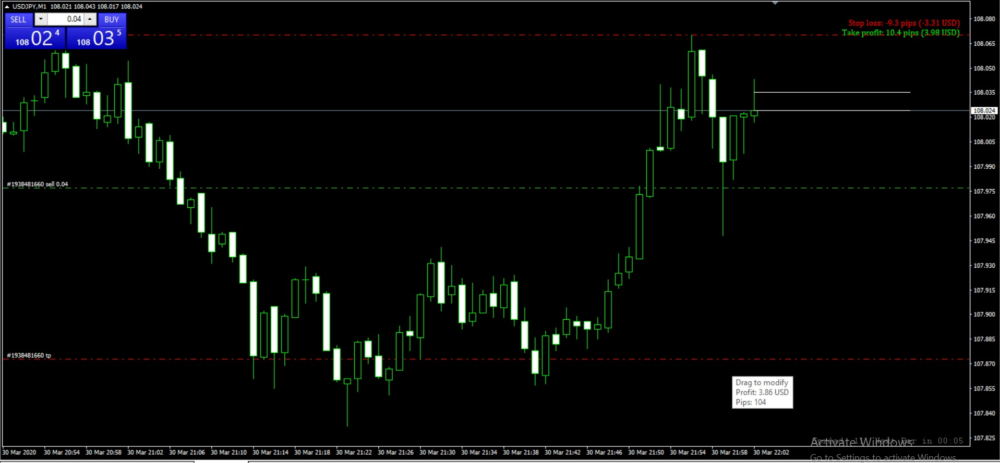

# total sl tp

> Source: https://fxcodebase.com/code/viewtopic.php?f=38&t=69573  
> Forum: 38 · Topic 69573 · 8 post(s)

---

## total sl tp

**Apprentice** · Wed Mar 25, 2020 6:12 am

Based on request.
[viewtopic.php?f=27&t=69554](https://fxcodebase.com/code/viewtopic.php?f=27&t=69554)

 [total sl tp.mq4](files/132259/total%20sl%20tp.mq4)

---

## Re: total sl tp

**zero999** · Wed Mar 25, 2020 10:22 am

> **Apprentice wrote:**
> Based on request.
> [viewtopic.php?f=27&t=69554](https://fxcodebase.com/code/viewtopic.php?f=27&t=69554)
>
>
> The attachment **total sl tp.mq4** is no longer available

This is good, but please apply these
1. Also show by deposit currency
2. When we break evan and change stop loss, the stop loss number may be positive.
3. Display the + or - sign along with the stop loss number and change the number from red to green
Example:

Total Losses PIP = sl Position1 (-100pip) + sl P2 (-40pip) + sl P3 (-10pip) = - 150 PIP (red)
Total Losses $ = sl P1 (-100 $) + sl P2 (-40 $) + sl P3 (-10 $) = - 150 $ (red)

Total Losses PIP = sl P1 (+ 50pip) + sl P2 (+ 20pip) + sl P3 (-10pip) = + 60 PIP (green)
Total Losses $ = sl P1 (+50 $) + sl P2 (+20 $) + sl P3 (-10 $) = + 60 $ (green)

4. Ability to choose colors for each part
5. Possibility of displaying location
6. No need to display day, hour and indicator name

 

---

## Re: total sl tp

**Apprentice** · Thu Mar 26, 2020 6:27 am

Your request is added to the development list.
Development reference 946.

---

## Re: total sl tp

**Apprentice** · Mon Mar 30, 2020 7:17 am

[total sl tp.mq4](files/132370/total%20sl%20tp.mq4)

Try this version.

---

## Re: total sl tp

**zero999** · Mon Mar 30, 2020 3:59 pm

thanks bro
That's what I wanted. There is a small bug. It does not consider spreads (bid and ask price) in profit and loss

 

 

---

## Re: total sl tp

**Apprentice** · Tue Mar 31, 2020 5:18 am

Your request is added to the development list.
Development reference 973.

---

## Re: total sl tp

**Apprentice** · Wed Apr 01, 2020 6:31 am

It's not a bug.
There is no need to consider that.
 Stop-loss has the same value no matter the type of price - bid or ask.

---

## Re: total sl tp

**zero999** · Wed Apr 01, 2020 8:31 am

Look at the pictures
The amount shown in the indicator differs from the amount shown in the SL AND TP line window.
