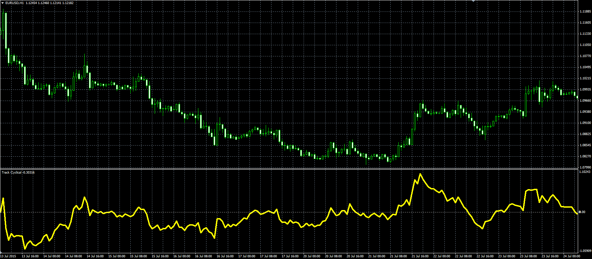

# Track Cyclical

> Source: https://fxcodebase.com/code/viewtopic.php?f=38&t=62612  
> Forum: 38 · Topic 62612 · 1 post(s)

---

## Track Cyclical

**Alexander.Gettinger** · Mon Aug 31, 2015 11:36 am

Original LUA oscillator: [viewtopic.php?f=17&t=62502](https://fxcodebase.com/code/viewtopic.php?f=17&t=62502).

Formula:
FC = 100*(Price-MA)/MA, where
MA - moving average with [Length] number of periods and [Method] type.

 

Download:

 [Track_Cyclical.mq4](files/102099/Track_Cyclical.mq4)
