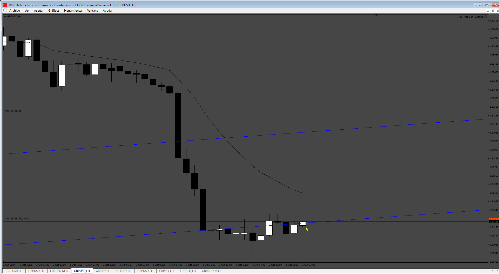

# Trade_In_Channel

> Source: https://fxcodebase.com/code/viewtopic.php?f=38&t=75261  
> Forum: 38 · Topic 75261 · 1 post(s)

---

## Trade_In_Channel

**Apprentice** · Sun Oct 06, 2024 3:04 am

Based on the request.
[https://fxcodebase.com/code/viewtopic.php?f=38&t=75243](https://fxcodebase.com/code/viewtopic.php?f=38&t=75243)

The EA identifies the channel between the name, so you have to use the name “Trade” by default (you can change in EA inputs)

 [Trade_In_Channel.mq4](files/156885/Trade_In_Channel.mq4)
