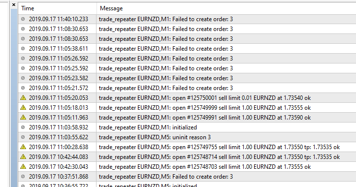

# trade_repeater

> Source: https://fxcodebase.com/code/viewtopic.php?f=38&t=68914  
> Forum: 38 · Topic 68914 · 38 post(s)

---

## trade_repeater

**Apprentice** · Fri Sep 13, 2019 6:05 am

[trade_repeater.mq4](files/128651/trade_repeater.mq4)

Based on request.
[viewtopic.php?f=27&t=68894](https://fxcodebase.com/code/viewtopic.php?f=27&t=68894)

TS2/Lua version.
[viewtopic.php?f=31&t=65821](https://fxcodebase.com/code/viewtopic.php?f=31&t=65821)

---

## Re: trade_repeater

**flbrgz** · Mon Sep 16, 2019 6:27 am

Hello all.

Hello Apprentice.

I have tested out the trade repeater but unfortunately it is not placing orders for me..

I have Auto Trading enabled. The trade_repeater and smiley face are showing on the chart.

I have checked, ticked all options on the trade repeater form, allow import dlls etc.

Maybe I am doing something wrong.

Maybe it is that the direction of the trade means that the current price may change is from a sell limit to a sell stop. Maybe it needs to check current price against the order to be placed and set it to the right type, sell limit, sell stop.

Hope we can work this out. Thanks for your efforts

---

## Re: trade_repeater

**flbrgz** · Mon Sep 16, 2019 10:58 pm

Hello there,

Here is a capture of the expert log, seems that sometimes it copies other times it fails.

 

Thanks again,

---

## Re: trade_repeater

**Apprentice** · Wed Sep 18, 2019 6:41 am

Your request is added to the development list.
Development reference 103.

---

## Re: trade_repeater

**Apprentice** · Thu Sep 19, 2019 12:55 pm

Can't repeat it myself. Added more logging for that error.

---

## Re: trade_repeater

**flbrgz** · Fri Sep 20, 2019 1:23 am

Do I just download from the previous link or are releasing a new link

Regards Paul

---

## Re: trade_repeater

**Apprentice** · Mon Sep 23, 2019 5:53 am

From the first topic, this topic.

---

## Re: trade_repeater

**flbrgz** · Fri Sep 27, 2019 7:36 am

Hello all.

Tested it out again but doesn't seem to place orders. I am getting a lot of magic number: 0 in the experts tab.

Any further ideas as to what settings I should try.

---

## Re: trade_repeater

**flbrgz** · Mon Sep 30, 2019 1:12 am

Hello all.

Tried it again today on my main computer. Tried it with Ic markets and pepperstone mt4 demo accounts. Still no luck.

I am getting the same errors as before and now seem to be getting magic number 0; in the experts log.

Cheers.

---

## Re: trade_repeater

**Apprentice** · Fri Oct 04, 2019 7:16 am

magic number is not an error. I have no issues with it. It works as expected. And the screenshot doesn't have any errors as well

---

## Re: trade_repeater

**flbrgz** · Fri Oct 04, 2019 7:35 am

All good. Maybe it's something to do with my broker.

As it doesn't work for me I will just have to stay with fxcm trading station and the original fxcm version.

Regards Paul.

---

## Re: trade_repeater

**flbrgz** · Mon Oct 07, 2019 5:50 pm

Hello again,

Could you tell me the broker you have tested this with and probably the version of mt4 you have used. If I can get it going I will probably still transfer over depending on if they are available in Australia.

Regards Paul.

---

## Re: trade_repeater

**Apprentice** · Wed Oct 09, 2019 11:05 am

My broker was FXCM.

---

## Re: trade_repeater

**flbrgz** · Fri Oct 11, 2019 12:08 am

Hello,

Yep definitely works with fxcm so you are spot on with your coding.

I am trying to find another broker that it will run on at the moment as I am looking at up to a 3 pjp spread difference between fxcm and some of the brokers on the currency pairs I trade.

I think it working with fxcm has to do with SL/TP Pre-Execution that fxcm supports. I don't think other brokers all support this.

If anyone has downloaded this and has it working with none fxcm brokers then please let me know.

Again. Thanks for your help.

---

## Re: trade_repeater

**nh0xh4mzuj** · Fri Nov 20, 2020 9:42 pm

Hello !
I think I am looking for an ea similar.
The EA will always repeat the closed trades, with the same entry point and TP SL.
I have checked ea Trade_Repeater. when I close a transaction. EA open 2 sometimes 4 pending orders at the same time.
If possible . Please help me with a new upgrade table of ea trade_repeter.
When a transaction is closed manually or a TP, SL. EA will open 1 pending order same as the closed transaction.
Thanks so much for the work you are doing .

---

## Re: trade_repeater

**Apprentice** · Sun Nov 22, 2020 5:00 am

Your request is added to the development list.
Development reference 2346.

---

## Re: trade_repeater

**Apprentice** · Sun Nov 22, 2020 5:53 pm

It opens only one order. It's likely that you are running several instances of EA.

---

## Re: trade_repeater

**nh0xh4mzuj** · Mon Nov 23, 2020 8:14 am

I am testing EA.
XAUUSD pair. time frame m1. SL TP 100pip.
EA does not repeat the pending order when it hits a TP or SL

When I manually close the transaction. At this time, EA will repeat the order just closed.

---

## Re: trade_repeater

**Apprentice** · Mon Nov 23, 2020 1:48 pm

Your request is added to the development list.
Development reference 2350.

---

## Re: trade_repeater

**Apprentice** · Wed Nov 25, 2020 11:39 am

EA doesn't check the reason for the closure. For every closed position, it should open an order.

Try to look at the expert's tab.
It's likely that it has some error with a reason why the order wasn't created.

---

## Re: trade_repeater

**nh0xh4mzuj** · Fri Nov 27, 2020 8:28 am

EA does not place an order after closing with TP or SL

---

## Re: trade_repeater

**Apprentice** · Sun Nov 29, 2020 3:14 am

Your request is added to the development list.
Development reference 2372.

---

## Re: trade_repeater

**Apprentice** · Mon Nov 30, 2020 10:34 am

I don't have such an issue.
Take a look at the expert's tabs after that happens.
It's likely that it has some error there.

---

## Re: trade_repeater

**Krypt0n1te** · Tue Jan 26, 2021 7:51 pm

Dear Apprentice

You have kindly helped in the past with a request and I am really grateful. I wish I had any coding skills.

Could I please request an mq5 version of the file on page 1, please? I have no idea how to change mq4 to mq5.

Many thanks

---

## Re: trade_repeater

**Apprentice** · Wed Jan 27, 2021 3:25 am

Your request is added to the development list.
Development reference 120.

---

## Re: trade_repeater

**Krypt0n1te** · Fri Jan 29, 2021 12:17 pm

Dear Apprentice

I know the request to change this version to MT5 is still under development request 120 but I would please like you to just quickly look into this current MT4 version.

As for other members, this EA fails to place an order for me.

In order for me not to waste your time, I have done the following testing...

1. I tried the EA with 3 different MT4 brokers
a) OctaFX live account tried on both EURUSD and BTCUSD
b) FXChoice demo account tried on both EURUSD and BTCUSD
c) FXCM demo account tried on both EURUSD and BTCUSD

**After I have done all that I repeated everything on a different laptop,** each time with the same result.

I am not sure if I am doing something wrong but this is the way I tried...

1. Download trade_repeater.mq4 from the first page
2. Navigate to the Downloads folder and copy the downloaded file.
3. Open MT4 terminal and go to File>Open Data Folder>MQL4>Experts and then paste the downloaded file.
4. I now go to Navigator panel on MT4, Right Click Expert Advisors and hit refresh
5. trade_repeater shows up under Expert Advisors and I double click the file.
6. There are **no options** except for the Common Tab where I now enable "Allow live trading" I have tried everything here also "Allow DLL imports"
7. Then I enable AutoTrading (Ctrl+E) right at the top of MT4
8. trade_repeater with a smiley face is on the chart and if I look at the Experts tab on the terminal I can see that it is initialized without any errors.
9. When a trade closes I also get the Magic Number 0 message, no error messages, but the new trade is NOT placed by the EA.

I promise I really tried for hours. Maybe I am missing something very stupid.

Thank you so much for your help to the community.

 

 

---

## Re: trade_repeater

**Apprentice** · Sat Jan 30, 2021 6:13 am

Your request is added to the development list.
Development reference 132.

---

## Re: trade_repeater

**Apprentice** · Sun Jan 31, 2021 10:09 am

I can't the version which prints such strings.
 It looks like you are using a version modified by someone else.

---

## Re: trade_repeater

**Krypt0n1te** · Sun Jan 31, 2021 2:10 pm

> **Apprentice wrote:**
> I can't the version which prints such strings.
> It looks like you are using a version modified by someone else.

Dear Apprentice

Again thanks for your time. I really appreciate it.

I am 100% sure that I am using the file that you attached on page 1 of this thread.

I have never downloaded any EA from any other source.

[download/file.php?id=26227](https://fxcodebase.com/code/download/file.php?id=26227)

Is it by any means possible to re-upload the version that is working correctly for you?
Or could you perhaps ask someone else to test the file on page one and see if it is working for them? I have asked other members who commented on this thread and it is also not working for them.

Please see the details of the downloaded file.

Kindest Regards

 

 

 [trade_repeater.mq4](files/140479/trade_repeater.mq4)

---

## Re: trade_repeater

**Apprentice** · Thu Feb 04, 2021 7:45 am

Your request is added to the development list.
Development reference 147.

---

## Re: trade_repeater

**Apprentice** · Sun Feb 07, 2021 6:36 pm

download/file.php?id=26227
Yes, I've used that file.

---

## Re: trade_repeater

**Krypt0n1te** · Mon Feb 08, 2021 5:14 am

> **Apprentice wrote:**
> download/file.php?id=26227
> Yes, I've used that file.

But Apprentice, this is the same file that is not working for any of us in this thread?

This EA is not placing orders. Not for me or the other members.

---

## Re: trade_repeater

**Krypt0n1te** · Fri Feb 12, 2021 1:14 am

> **Krypt0n1te wrote:**
>
>
> > **Apprentice wrote:**
> > download/file.php?id=26227
> > Yes, I've used that file.
>
>
>
> **But Apprentice, this is the same file that is not working for any of us in this thread?
>
> This EA is not placing orders. Not for me or the other members**.

Dear Apprentice

Just a kind bump in case my post went unnoticed.

Based on the popularity of this EA I really feel it's worth it to please have a look and have it fixed.

Regards

---

## Re: trade_repeater

**Apprentice** · Wed May 12, 2021 10:06 am

[trade_repeater.mq4](files/142057/trade_repeater.mq4)

Try this version.

---

## Re: trade_repeater

**sepehrtrd** · Tue Mar 28, 2023 6:12 am

thanks alot for your valuable experts , about trade repeater , please add timer (in second ) , to reactive closed orders ( one delay timer for TP , another delay timer for SL) , ALSO , OPTION to Count Candles instead of time , for example 360 sec after TP , re put order , or after next 6 candles ( in 1 minute time frame - or other time frame when sl/tp occur ) re put same order , Also In trailing stop , it does not put trailed same SL in this version , if possible upgrade it , , appreciate to your valuable skill , regards , sepehrtrd ,

---

## Re: trade_repeater

**Apprentice** · Tue Mar 28, 2023 9:31 am

We have added your request to the development list.
Development reference 282.

---

## Re: trade_repeater

**sepehrtrd** · Fri Apr 14, 2023 10:02 am

Dear Sir
Development reference 282.
is not ready ?

---

## Re: trade_repeater

**sepehrtrd** · Tue Jun 27, 2023 1:41 pm

> **Apprentice wrote:**
> We have added your request to the development list.
> Development reference 282.

any news?
