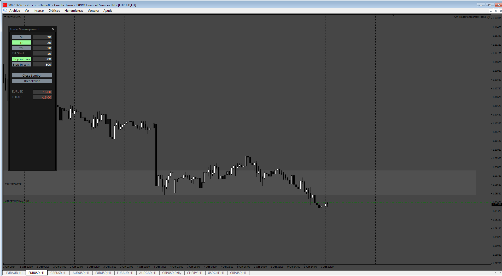
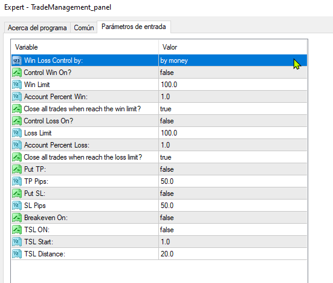

# TradeManagement_panel

> Source: https://fxcodebase.com/code/viewtopic.php?f=38&t=75273  
> Forum: 38 · Topic 75273 · 5 post(s)

---

## TradeManagement_panel

**Apprentice** · Sat Oct 12, 2024 12:03 pm

Based on the request.
[https://fxcodebase.com/code/viewtopic.php?f=38&t=75246](https://fxcodebase.com/code/viewtopic.php?f=38&t=75246)

 [TradeManagement_panel.mq4](files/156952/TradeManagement_panel.mq4)

---

## Re: TradeManagement_panel

**Satya264** · Sat Oct 12, 2024 2:23 pm

i don't need a panel on chart
nothing is available in this EA

just add all in the EA

tp any trade on chart (TRUE OF FALSE)

sl any trade on chart (TRUE OF FALSE)

trail stop any trade on chart (TRUE OF FALSE)

break even any trade on chart (TRUE OF FALSE)

auto trading only enable time on local time (TRUE OF FALSE)
PLEASE SET AUTO TRADING ONLY enable LOCAL TIME (5 TIMES)
IF AUTO TRADING IS ON THEN DO NOTHING

SET AS ON TIME 1-6AM (TRUE OF FALSE)
SET AS ON TIME 2-8AM (TRUE OF FALSE)
SET AS ON TIME 3-9AM (TRUE OF FALSE)
SET AS ON TIME 4-11AM (TRUE OF FALSE)
SET AS ON TIME 5-1PM (TRUE OF FALSE)

AND AUTO TRADING OFF BY OTHER

equity Monitoring on chart (TRUE OF FALSE)

IF equity REACH PROFIT/LOSS LIMIT BY AMOUT OR PERCENT THEN CLOSE ALL TRADE BEFORE CLOSE META TRADER (TRUE OF FALSE)

IF equity REACH PROFIT/LOSS LIMIT BY AMOUT OR PERCENT THEN CLOSE ALL TRADE BEFORE auto trading off (TRUE OF FALSE)

IF equity REACH PROFIT/LOSS LIMIT BY AMOUT OR PERCENT THEN close all trade (TRUE OF FALSE)

equity Monitoring SET AS CONDITION PRESENT EQUITY AMOUNT (TRUE OF FALSE)

---

## Re: TradeManagement_panel

**VuxxLong** · Mon Oct 14, 2024 11:19 pm

Would you kindly provide a button for "Open Orders" with the possibility to select lots by risk percent or fixed?

---

## Re: TradeManagement_panel

**Apprentice** · Thu Oct 17, 2024 5:06 pm

We have added your request to the development list.
Development reference 789

---

## Re: TradeManagement_panel

**Apprentice** · Sat Oct 26, 2024 6:01 am

 [TradeManagement.mq4](files/157078/TradeManagement.mq4)
