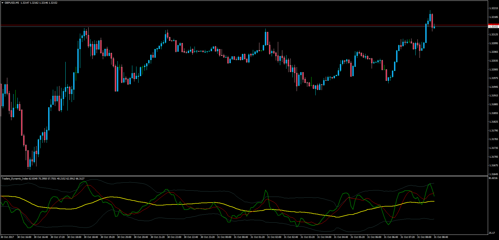
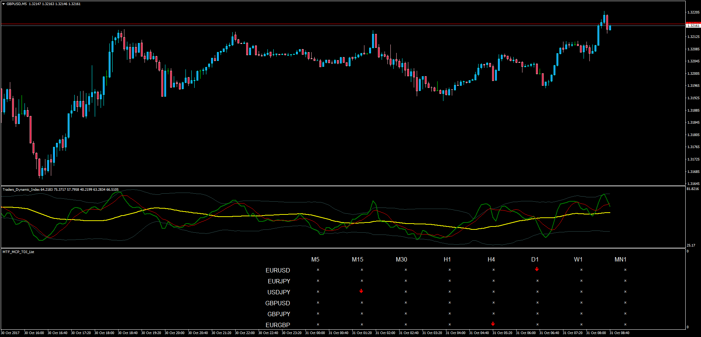

# Traders Dynamic Index

> Source: https://fxcodebase.com/code/viewtopic.php?f=38&t=65322  
> Forum: 38 · Topic 65322 · 2 post(s)

---

## Traders Dynamic Index

**Apprentice** · Tue Oct 31, 2017 4:23 am

LUA Original: [viewtopic.php?f=17&t=2069](https://fxcodebase.com/code/viewtopic.php?f=17&t=2069)

Description:

This is a simplified MT4 version of the LUA original TDI and gives all the necessary values for further development in other applications such a MTF MCP TDI List.

This sub-window indicator is formed by 2 bands, one top and another bottom, then the average of those 2 creates the base line. Finally, the price and signal lines are the ones creating the dynamic analysis.

 [Traders_Dynamic_Index.mq4](files/115783/Traders_Dynamic_Index.mq4)

---

## MTF MCP TDI List

**Apprentice** · Tue Oct 31, 2017 4:24 am

LUA Original: [viewtopic.php?f=17&t=61317](https://fxcodebase.com/code/viewtopic.php?f=17&t=61317)

Description:

This MT4 dashboard created from the LUA original, allows to view in one single place what pairs and time frames are producing buy and sell signals according to the following criteria:

OVER BOUGHT LEVEL: 70
OVER SOLD LEVEL: 30
BUY ENTRY LEVEL: 50
SELL ENTRY LEVEL:50

GREEN UP ARROW:

1.PRICE LINE> SIGNAL LINE AND SIGNAL LINE >BASE LINE
2.AND BASE LINE> BUY ENTRY LEVEL
3. AND PRICE LINE < UPPER BAND
4. AND PRICE LINE < BUY EXIT LEVEL

RED DOWN ARROW:

1.PRICE LINE< SIGNAL LINE AND SIGNAL LINE <BASE LINE
2.AND BASE LINE< SELL ENTRY LEVEL
3. AND PRICE LINE > LOWER BAND
4. AND PRICE LINE > SELL EXIT LEVEL

 [MTF_MCP_TDI_List.mq4](files/115784/MTF_MCP_TDI_List.mq4)
