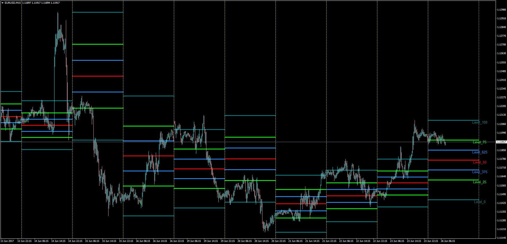

# Traders Trinity

> Source: https://fxcodebase.com/code/viewtopic.php?f=38&t=64844  
> Forum: 38 · Topic 64844 · 6 post(s)

---

## Traders Trinity

**Apprentice** · Mon Jun 26, 2017 3:24 am

LUA Original: [viewtopic.php?f=17&t=10882](https://fxcodebase.com/code/viewtopic.php?f=17&t=10882)

Description:

The calculations are always done on the previous period data and the lines are then draw in the next period. Similar to how pivot points are calculated.

Previous period High / Low range, defined levels for the current period.

25%, 37,5%, 50%, 62,5% and 75% Lines are drawn.

The trader can define the cycle to calculate: daily, H4, weekly, etc.

 [TradersTrinity.mq4](files/113152/TradersTrinity.mq4)

---

## Re: Traders Trinity

**Stomp2k** · Thu Oct 25, 2018 9:09 am

Is it possible to have the levels shift back to overlay the period they were created from.
I could use a similar indicator that defines a prior weeks high and low point and verify its end of week retracement level if one had been created.

---

## Re: Traders Trinity

**Apprentice** · Thu Oct 25, 2018 1:20 pm

Your request is added to the development list under Id Number 4276

---

## Re: Traders Trinity

**Apprentice** · Fri Oct 26, 2018 4:39 am

We made an additional option for this request (Show on calculated range).

 [TradersTrinity With Shift.mq4](files/121758/TradersTrinity%20With%20Shift.mq4)

---

## Re: Traders Trinity

**Stomp2k** · Fri Oct 26, 2018 5:49 am

awesome!

I have downloaded Traders Trinity with Shift. Awesome Job.
Can it be turned into an EA as described in my other post as below:

Previous Week High/Low Fibo

I am wanting an indicator / EA to encapsulate or box in the previous week from lowest low and highest high. I then need a fibo plotted on the previous week from low to high or high to low, showing only the .382 retracement level and the 1.27 extension level. I would like to have send push notification option when the .382 is hit to manually take a trade and an EA (if deployed) to take the trade at the .382 level by default, limit set to the 1.27 and the stop to be set to previous week 100% level of fibo or autoclose trade prior to current weekly close. the EA must be set as pending orders at the opening of the next week since some of the .382 levels may have already been hit within the previous week period. This should work on any time frame below the weekly TF since the highs and lows will remain the same.

* I understand these request may only be completed at the opening of the next bar, and that is fine.
This strategy is traded on opening of current week based upon past week conditions.

This needs to be for the mt4 platform

---

## Re: Traders Trinity

**Apprentice** · Fri Oct 26, 2018 7:04 am

Your request is added to the development list under Id Number Bug 4284
