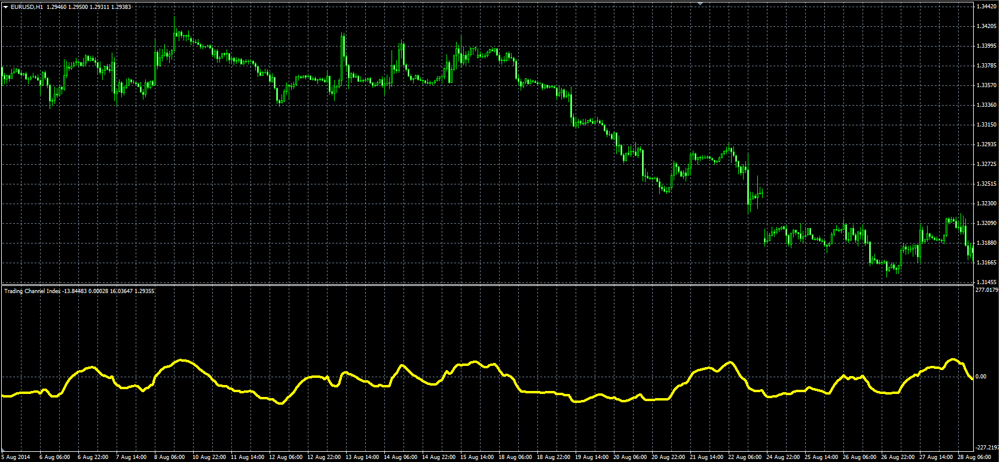

# Trading Channel Index

> Source: https://fxcodebase.com/code/viewtopic.php?f=38&t=61155  
> Forum: 38 · Topic 61155 · 1 post(s)

---

## Trading Channel Index

**Alexander.Gettinger** · Mon Sep 15, 2014 12:31 pm

Original LUA oscillator: [viewtopic.php?f=17&t=32945](https://fxcodebase.com/code/viewtopic.php?f=17&t=32945).

Formula:
TPI = EMA(B2, Average_Length), where
B2 = (Price-MA1)/(Coeff*MA2),
MA2 = EMA(B1, Channel_Length),
B1 = Abs(Price-MA1),
MA1 = EMA(Price, Channel_Length),
Abs - absolute value.

 

Download:

 [TPI.mq4](files/95907/TPI.mq4)
