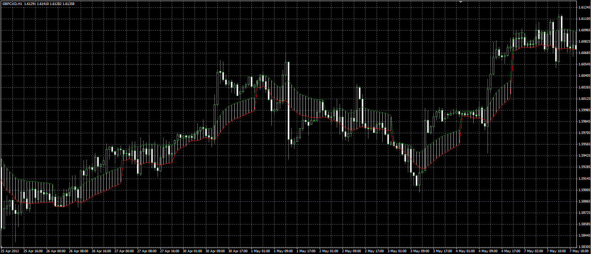

# Trading day average indicator

> Source: https://fxcodebase.com/code/viewtopic.php?f=38&t=17983  
> Forum: 38 · Topic 17983 · 14 post(s)

---

## Trading day average indicator

**Alexander.Gettinger** · Tue May 08, 2012 5:11 pm

Original indicator: [viewtopic.php?f=17&t=12840&p=26694](https://fxcodebase.com/code/viewtopic.php?f=17&t=12840&p=26694)

> The indicator calculates the values ​​of the average High and Low prices during the trading day.
> The beginning of the trading day is defined as a parameter.
>
> For example:
> Timeframe: H1,
> BeginTime: 02:00
> For "02:00" candle: HighAvg("02:00")=High("02:00"), LowAvg("02:00")=Low("02:00"),
> for "03:00" candle: HighAvg("03:00")=(High("03:00")+High("02:00"))/2, LowAvg("03:00")=(Low("03:00")+Low("02:00"))/2, etc.

 

Download:

 [Trading_Day_Average.mq4](files/32538/Trading_Day_Average.mq4)

---

## Re: Trading day average indicator

**optionhk** · Tue Feb 02, 2021 2:22 am

Can you please modify this indicator so that

it calculates a series of minimums and maximums pips over a certain period of bars for calculating or understand Support and Resistance areas or Small Breakouts trend.

Bars may be defined or Pips may be defined.
If bars defined by user then Pips will be printed on chart for High and Low as a band.
If Pips defined by user then Closed Bars (of chosen TF) will be printed showing High and Lows as a band.

Minimum or maximum can be even 1 Pip if defined by the user. Like your trading average indicator no need to select high low by using technical logic.

A combination of multiple such "levels" will show show a "trend" and a possible support or resistance zones

---

## Re: Trading day average indicator

**optionhk** · Tue Feb 02, 2021 2:37 am

It is an excellent indicator.
Can you please modify it to accept inputs by user instead of using high low.
Example;
I want to find out trend of a small breakout.
I decide to select two inputs one for high and another for low.

I select Time for calculation Say 2:00 to 3:00 to create Pips Bands or Time Bar bands

I select TF1 and then define High as 12 pips and Low as 4 pips.

Now I get a window to observe Trend between the two.
-----------
I select time say 3:00 to 9:00 to create Time bar bands
TF 30m
I select Number of Bars to define High and Low as 12 bars
Now I get a window to observe Trend between 12 bars.

Thank you.

---

## Re: Trading day average indicator

**Apprentice** · Tue Feb 02, 2021 11:42 am

Your request is added to the development list.
Development reference 142.

---

## Re: Trading day average indicator

**Apprentice** · Sat Feb 06, 2021 10:59 am

I don't understand how it should be calculated. An example will help

---

## Re: Trading day average indicator

**optionhk** · Thu Feb 11, 2021 1:26 am

> **Apprentice wrote:**
> I don't understand how it should be calculated. An example will help

---

## Re: Trading day average indicator

**optionhk** · Thu Feb 11, 2021 1:28 am

> **optionhk wrote:**
> It is an excellent indicator.
> Can you please modify it to accept inputs by user instead of using high low.
> Example;
> I want to find out trend of a small breakout.
> I decide to select two inputs one for high and another for low.
>
> I select Time for calculation Say 2:00 to 3:00 to create Pips Bands or Time Bar bands
>
> I select TF1 and then define High as 12 pips and Low as 4 pips.
>
> Now I get a window to observe Trend between the two.
> -----------
> I select time say 3:00 to 9:00 to create Time bar bands
> TF 30m
> I select Number of Bars to define High and Low as 12 bars
> Now I get a window to observe Trend between 12 bars.
>
> Thank you.

---

## Re: Trading day average indicator

**Apprentice** · Thu Feb 11, 2021 4:48 am

Indicator will show High/Low of last N candles.
+/- X pips above and below?

---

## Re: Trading day average indicator

**optionhk** · Thu Feb 11, 2021 5:01 am

The indicator should if possible show data options for HIgh Low and Open close.
And show either high low or open close of last N candles and +/-X pips above below
like a band.

---

## Re: Trading day average indicator

**optionhk** · Fri Feb 12, 2021 12:23 am

> **Apprentice wrote:**
> Indicator will show High/Low of last N candles.
> +/- X pips above and below?

Yes please

but with two data options to be selected.

High Low
or
Open Close.

Thank you.

---

## Re: Trading day average indicator

**Apprentice** · Fri Feb 12, 2021 10:33 am

Your request is added to the development list.
Development reference 186.

---

## Re: Trading day average indicator

**optionhk** · Sat Feb 27, 2021 10:40 am

I found the idea of having both pip height and price grid coded by an FF coder.
The exe (mql not available) is attached for your reference.

---

## Re: Trading day average indicator

**Apprentice** · Fri May 14, 2021 5:01 am

[Trading_Day_Average.mq4](files/142089/Trading_Day_Average.mq4)

Try this version.

---

## Re: Trading day average indicator

**optionhk** · Tue Jul 20, 2021 1:05 am

> **Apprentice wrote:**
>
>
> Trading_Day_Average.mq4
>
>
> Try this version.

Thank you.
