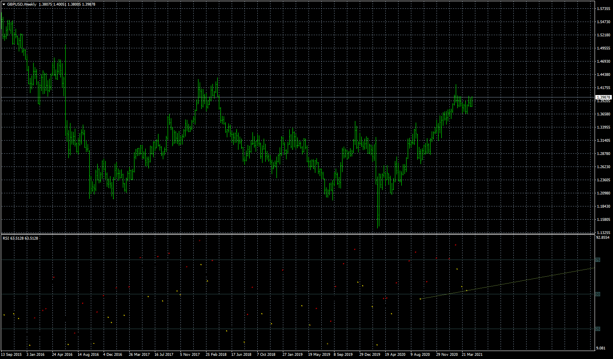

# Trading Divergence in the markets!

> Source: https://fxcodebase.com/code/viewtopic.php?f=38&t=71177  
> Forum: 38 · Topic 71177 · 6 post(s)

---

## Trading Divergence in the markets!

**Zeus001** · Fri May 07, 2021 5:24 am

Trading divergence is one of the best ways to forecast a market turn for entries or possible exits. This indicator should easily serve that purpose.
You are all welcome!

 [aio_divergence.mq4](files/141935/aio_divergence.mq4)

---

## Re: Trading Divergence in the markets!

**Zeus001** · Sat May 08, 2021 7:25 am

This is the ZeroLag MACD 1.02 with multi-timeframe options!
A great tool for detecting Divergence...
ENJOY

---

## Re: Trading Divergence in the markets!

**Zeus001** · Sun May 09, 2021 10:32 pm

> **Zeus001 wrote:**
>
>
> gbpusd-w1-fxcm-australia-pty.png
>
>
> Trading divergence is one of the best ways to forecast a market turn for entries or possible exits. This indicator should easily serve that purpose.
> You are all welcome!
>
>
> aio_divergence.mq4

Greetings Apprentice,
Would like to request for an MT5 VERSION of this indicator for the traders who trade on tht trading platform.

---

## Re: Trading Divergence in the markets!

**Zeus001** · Sun May 09, 2021 10:34 pm

> **Zeus001 wrote:**
> This is the ZeroLag MACD 1.02 with multi-timeframe options!
> A great tool for detecting Divergence...
> ENJOY

Greetings Apprentice,
Would like to request for an MT5 VERSION of this indicatorZeroLag MACD 1.02 with multi-timeframe options for the traders who trade on that trading platform.

---

## Re: Trading Divergence in the markets!

**Apprentice** · Tue May 11, 2021 3:24 am

Your request is added to the development list.
Development reference 464.

---

## Re: Trading Divergence in the markets!

**Zeus001** · Mon Jun 28, 2021 6:14 am

> **Apprentice wrote:**
> Your request is added to the development list.
> Development reference 464.

Any Progress...?
