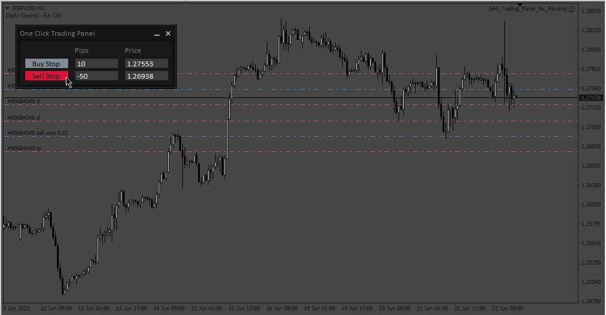

# Trading_Panel_for_Pending

> Source: https://fxcodebase.com/code/viewtopic.php?f=38&t=73875  
> Forum: 38 · Topic 73875 · 1 post(s)

---

## Trading_Panel_for_Pending

**Apprentice** · Mon Jun 26, 2023 3:33 pm

Based on the request.
[https://fxcodebase.com/code/viewtopic.php?f=27&p=151299](https://fxcodebase.com/code/viewtopic.php?f=27&p=151299)
(+) Pips: to put an Order Above current symbol price
(-) Pips: to put an Order Below the current symbol price

 [Trading_Panel_for_Pending.mq4](files/151430/Trading_Panel_for_Pending.mq4)
