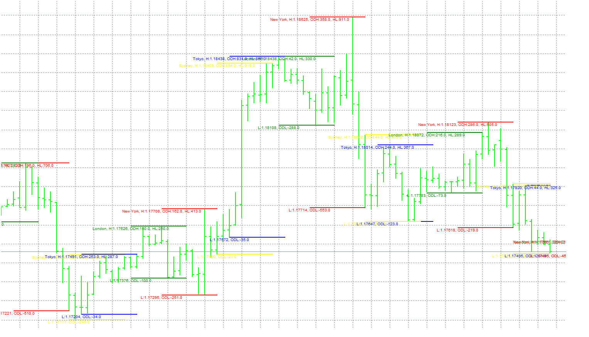

# Trading Session Hours

> Source: https://fxcodebase.com/code/viewtopic.php?f=38&t=65457  
> Forum: 38 · Topic 65457 · 9 post(s)

---

## Trading Session Hours

**Apprentice** · Sun Dec 17, 2017 6:21 am

FXCM TS2 version.
[viewtopic.php?f=17&t=1974](https://fxcodebase.com/code/viewtopic.php?f=17&t=1974)

 [TRADESESSIONS.mq4](files/116506/TRADESESSIONS.mq4)

---

## Re: Trading Session Hours

**ForexGuy** · Wed Dec 20, 2017 3:05 pm

Hi,
Thanks a lot for the pips modification, it looks great now and is easier to read.
There is a small problem with the indicator (at least in my opinion): there are some labels at current candle that are overlapping (see attached pic where I circled the labels). Is there any chance of getting rid of those labels if they are not used for anything?
Thanks again.

---

## Re: Trading Session Hours

**Apprentice** · Thu Dec 28, 2017 6:37 am

Your request is added to the development list under Id Number 3988

---

## Re: Trading Session Hours

**ForexGuy** · Mon Feb 05, 2018 9:41 am

Hello. Is there no one interested in making the minimum final adjustments mentioned above?
Thanks!

---

## Re: Trading Session Hours

**Apprentice** · Mon Feb 05, 2018 5:13 pm

Alex took this task.
Will see what I can do.

---

## Re: Trading Session Hours

**Apprentice** · Wed Jun 20, 2018 5:36 am

Try this version.

 [TRADESESSIONS.mq4](files/119643/TRADESESSIONS.mq4)

---

## Re: Trading Session Hours

**Dankettan** · Tue Aug 25, 2020 10:50 am

Man pl fix these 2 problems

1. there's lines on the left side of the Asia Range on every monday, plz clear it. (Image 1)
2. it will appear a line moving around with the current price when we stick to 1 chart for a period of time (image 2), when change TF, it will disappear, but plz clear it.

---

## Re: Trading Session Hours

**Apprentice** · Wed Aug 26, 2020 5:21 am

Your request is added to the development list.
Development reference 1936.

---

## Re: Trading Session Hours

**Apprentice** · Wed Sep 02, 2020 3:10 am

[TRADESESSIONS.mq4](files/137244/TRADESESSIONS.mq4)

Try this version.
