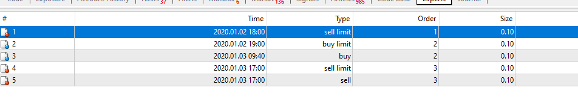

# Trading zones - momentum strategy

> Source: https://fxcodebase.com/code/viewtopic.php?f=38&t=70676  
> Forum: 38 · Topic 70676 · 35 post(s)

---

## Trading zones - momentum strategy

**Apprentice** · Wed Dec 02, 2020 4:52 am

Based on request.
[viewtopic.php?f=27&t=70631](https://fxcodebase.com/code/viewtopic.php?f=27&t=70631)

Will trade stocks at market open
Open Long/Open Short/ Both selector is required.

if selected
will open short -above yesterday close price moving DOWN
will open long - below yesterday close price moving UP

if we are moving down or up will be determined by this
UP
The opening of buy position happens once market price reaches X pips higher than opening price

DOWN
The opening of sell position happens once market price reaches X pips lower than opening price

stop/limit/trailing

 [Trading zones - momentum strategy.mq4](files/139252/Trading%20zones%20-%20momentum%20strategy.mq4)

---

## Re: Trading zones - momentum strategy

**Rocco_Rod** · Wed Dec 02, 2020 9:20 pm

Thanks Apprentice.

Can you look into the following issue on the attachment please : my instrument (ASX200) has not been priced at 5223 for weeks or months, yet it is at this level that the EA is placing a sell stop order.
According to my broker (pepperstone) & MT4, the last price of ASX200 before today's opening was 6613 (date: 3/12/20).

Remediation : alternatively that level could be input manually on the EA's setup panel. That would also allow the user to execute the EA at other high volatility moment than the market opening [example: central banker speech].

Question: on the EA's setup panel where is the X pips trigger to start "The opening of buy position happens once market price reaches X pips higher than opening price" ? is it the variable called "min distance to order to activate the trailing" ?

Cheers

---

## Re: Trading zones - momentum strategy

**Apprentice** · Thu Dec 03, 2020 12:33 pm

Your request is added to the development list.
Development reference 2392.

---

## Re: Trading zones - momentum strategy

**Rocco_Rod** · Sun Dec 06, 2020 6:25 am

The corrected version of the EA does not open (once installed on MT4). Can you check what's going on please ?

---

## Re: Trading zones - momentum strategy

**Apprentice** · Sun Dec 06, 2020 6:48 am

Your request is added to the development list.
Development reference 2408.

---

## Re: Trading zones - momentum strategy

**Apprentice** · Tue Dec 08, 2020 9:07 am

[Trading zones - momentum strategy.mq4](files/139388/Trading%20zones%20-%20momentum%20strategy.mq4)

Try this version.

---

## Re: Trading zones - momentum strategy

**Rocco_Rod** · Wed Dec 09, 2020 9:28 am

Thanks. Kindly correct the following :

On the attached snapshot the EA placed a sell limit order at 6730.5 - i assume it added the input distance to the input entry price. Yet the EA should have placed a sell limit order at 6729.7 instead. Explanation : 'opening price of current M1 candle' minus 'distance' = 6730.2 - 0.5 = 6729.7

Formula in the case of a buy limit order: 'opening price of current M1 candle' plus 'distance'

Cheers

---

## Re: Trading zones - momentum strategy

**Apprentice** · Thu Dec 10, 2020 5:41 am

Your request is added to the development list.
Development reference 2436.

---

## Re: Trading zones - momentum strategy

**Apprentice** · Sat Dec 12, 2020 7:35 am

Try this version.

 [Trading zones - momentum strategy.mq4](files/139494/Trading%20zones%20-%20momentum%20strategy.mq4)

---

## Re: Trading zones - momentum strategy

**Rocco_Rod** · Mon Dec 14, 2020 7:14 am

Thank you Apprentice.

We are almost done it seems. One issue remains : the EA still places the order based on the level of the 'entry price' input filled on the setup panel, which is not correct. Yet the EA should instead place the order at the level of the '**opening price of current M1 candle**' minus or plus 'distance'.

- 'opening price of current M1 candle' minus 'distance' for a sell order
- 'opening price of current M1 candle' plus 'distance' for a buy order

reminder : Sell orders should be placed over the 'entry price' input filled on the setup panel. Buy orders should be placed under the 'entry price' input filled on the setup panel.

---

## Re: Trading zones - momentum strategy

**Apprentice** · Tue Dec 15, 2020 11:32 am

Your request is added to the development list.
Development reference 2472.

---

## Re: Trading zones - momentum strategy

**Apprentice** · Wed Dec 16, 2020 10:30 am

[Trading zones - momentum strategy.mq4](files/139629/Trading%20zones%20-%20momentum%20strategy.mq4)

Try this version.

---

## Re: Trading zones - momentum strategy

**Rocco_Rod** · Thu Dec 17, 2020 12:55 am

Thanks Apprentice. The same last problem remains unsolved - see the attached :

The EA placed a sell order that is still not based on the opening price of the current M1 candle. Like previously, the EA took the entry price [6700] filled in on the setup panel [minus the Distance, i.e. 1] to place the sell order at 6699.9. But the opening price of the current M1 candle is 6708.9 so the sell order should instead have been placed at 6708.8.

Does this issue make sense to you ? Please let me know if there is something that i need to clarify for the correction to be carried out.

As far as i can see it is the last major pending item to address for the EA to work properly.

Cheers

---

## Re: Trading zones - momentum strategy

**Apprentice** · Fri Dec 18, 2020 5:16 am

Your request is added to the development list.
Development reference 2492.

---

## Re: Trading zones - momentum strategy

**Apprentice** · Tue Dec 22, 2020 4:41 am

Use 0 in the parameters for the price

---

## Re: Trading zones - momentum strategy

**Rocco_Rod** · Wed Dec 23, 2020 2:01 am

Hello Apprentice,

It is done with 0 in the parameters - you may find attached the screenshot showing the outcome. There is still an issue to fix. I added 2 red lines so we may see more clearly that remaining problem : they cross each other at the point that is today's market opening (6652.2 level, M1 chart). Then the EA should place the sell order at : 6652.2 - distance = 6652.1 instead of 6617.3

I do not understand how the EA comes up with this 6617.3 level. Can you check what's wrong and correct the EA please ?

Cheers

---

## Re: Trading zones - momentum strategy

**Apprentice** · Wed Dec 23, 2020 3:16 am

Your request is added to the development list.
Development reference 2519.

---

## Re: Trading zones - momentum strategy

**Rocco_Rod** · Thu Dec 24, 2020 2:03 am

Thank you Apprentice. It would be great if Dev# 2519 could also address the following issue :
for long positions the EA places limit orders while stop orders are placed for short positions. Can you instead have both the long and short positions opened with stop orders (placed by the EA) please ?

Cheers and Merry Christmas

---

## Re: Trading zones - momentum strategy

**Apprentice** · Fri Dec 25, 2020 5:20 am

[Trading zones - momentum strategy.mq4](files/139794/Trading%20zones%20-%20momentum%20strategy.mq4)

It always an opening of D1. This version uses the previous bar of the current timeframe.

---

## Re: Trading zones - momentum strategy

**optionhk** · Sat Jan 02, 2021 3:19 pm

> **Rocco_Rod wrote:**
> Thank you Apprentice.
>
> It would enhance the value of the EA if the exit is done by selection of minutes distance or open of any of TFs greater than the current TF in which trade is entered.
>
> Thank you..
>
>
>
> We are almost done it seems. One issue remains : the EA still places the order based on the level of the 'entry price' input filled on the setup panel, which is not correct. Yet the EA should instead place the order at the level of the '**opening price of current M1 candle**' minus or plus 'distance'.
>
> - 'opening price of current M1 candle' minus 'distance' for a sell order
> - 'opening price of current M1 candle' plus 'distance' for a buy order
>
> reminder : Sell orders should be placed over the 'entry price' input filled on the setup panel. Buy orders should be placed under the 'entry price' input filled on the setup panel.

---

## Re: Trading zones - momentum strategy

**Rocco_Rod** · Mon Jan 04, 2021 12:45 am

Good day Apprentice and Happy New Year,

Thank you for your last feedback. I was off for the last few days hence my late reply.

There are 3 problems to fix - see the attachments :

- the EA should use the current bar's opening (not the previous bar's) of the current timeframe.
- for long positions the EA wrongly places limit orders while it rightly places stop orders for short positions. Can you instead have both the long and short positions opened with **stop orders** (placed by the EA) please ?
- when sell stop order turns into sell order (=opening of short position) then the buy stop order should be cancelled. When buy stop order turns into buy order (=opening of long position) then the sell stop order should be cancelled.

Cheers

---

## Re: Trading zones - momentum strategy

**Apprentice** · Mon Jan 04, 2021 4:19 am

Your request is added to the development list.
Development reference 22.

---

## Re: Trading zones - momentum strategy

**Apprentice** · Tue Jan 05, 2021 8:53 am

I don't understand what is wrong with TP. It looks OK

 [Trading zones - momentum strategy.mq4](files/140012/Trading%20zones%20-%20momentum%20strategy.mq4)

---

## Re: Trading zones - momentum strategy

**Rocco_Rod** · Tue Jan 05, 2021 6:12 pm

I have not mentioned any issue with the TP. Kindly review the 3 pending issues that i have rephrased for the sake of clarity :

- For position opening, the EA should use the current bar's opening (not the previous bar's) of the current timeframe.
- for long positions the EA currently places limit orders (see the attachment) : it is wrong. Instead it should place stop orders. The same way as it already does for short positions (see the same attachment). Can you correct that please ?
- when sell stop order turns into sell order (=opening of short position) then the buy stop order should be cancelled. When buy stop order turns into buy order (=opening of long position) then the sell stop order should be cancelled.

Thank you

---

## Re: Trading zones - momentum strategy

**Apprentice** · Wed Jan 06, 2021 11:36 am

Your request is added to the development list.
Development reference 39.

---

## Re: Trading zones - momentum strategy

**Apprentice** · Sun Jan 10, 2021 2:32 am

I don't have any issues. Both orders are limit orders. It's likely that your spread is too big, so +n pip from the current price is still too low in order for the long order to became buy limit order

---

## Re: Trading zones - momentum strategy

**Rocco_Rod** · Sun Jan 10, 2021 4:18 am

Thanks for your feedback.

Can you address the 3 remaining problems please :

- Position entry => the EA should use the current bar's opening (not the previous bar's) of the current timeframe. Can you make that correction please ?
- when sell stop order turns into sell order (=entry in short position) then the buy stop order should be cancelled. When buy stop order turns into buy order (=entry in long position) then the sell stop order should be cancelled.
- you have mentioned that "Both orders are limit orders". Instead of that can you make them stop orders please ? I want stop orders instead of limit orders.

Please let me know if there is any of the above that needs clarification.

Cheers

---

## Re: Trading zones - momentum strategy

**Apprentice** · Mon Jan 11, 2021 5:13 am

Your request is added to the development list.
Development reference 66.

---

## Re: Trading zones - momentum strategy

**Apprentice** · Sun Feb 14, 2021 9:49 am

[Trading zones - momentum strategy.mq4](files/140727/Trading%20zones%20-%20momentum%20strategy.mq4)

Try this version.

---

## Re: Trading zones - momentum strategy

**Rocco_Rod** · Sun Feb 14, 2021 8:10 pm

Thank you for your feedback. It now selects the right candlestick when 0 is filled as the input of "entry price" on the setup panel. Yet the EA does not work properly when any other entry price is filled in. That needs to be fixed - kindly see my previous instructions on that functionality.

Cheers

---

## Re: Trading zones - momentum strategy

**Apprentice** · Tue Feb 16, 2021 2:44 pm

Your request is added to the development list.
Development reference 200.

---

## Re: Trading zones - momentum strategy

**Apprentice** · Wed Feb 17, 2021 10:58 am

It's unclear what it should do. When you set it to 0 it uses open price. When you set it to something else then it uses it as a price

---

## Re: Trading zones - momentum strategy

**Rocco_Rod** · Wed Feb 17, 2021 7:16 pm

"When you set it to 0 it uses open price" => I am happy with that.
"When you set it to something else then it uses it as a price" => I am not happy with that. When you set it to something else then it should also use the open price (exactly the same as the above).

Are you able to create 2 trading zones defined by one price ? the zone above that price does not let the EA generate any buy order ; the zone below that price does not let the EA generate any sell order.

Do you now understand the relevance of inputting a price on that field ?

Cheers

---

## Re: Trading zones - momentum strategy

**Apprentice** · Thu Feb 18, 2021 7:03 am

Your request is added to the development list.
Development reference 211.

---

## Re: Trading zones - momentum strategy

**Apprentice** · Sat Feb 20, 2021 2:55 pm

I don't understand why we need this parameter?
Can you show this on the example?
