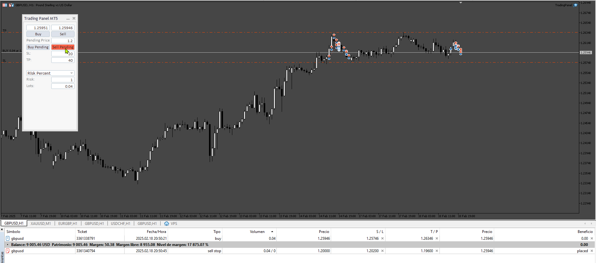
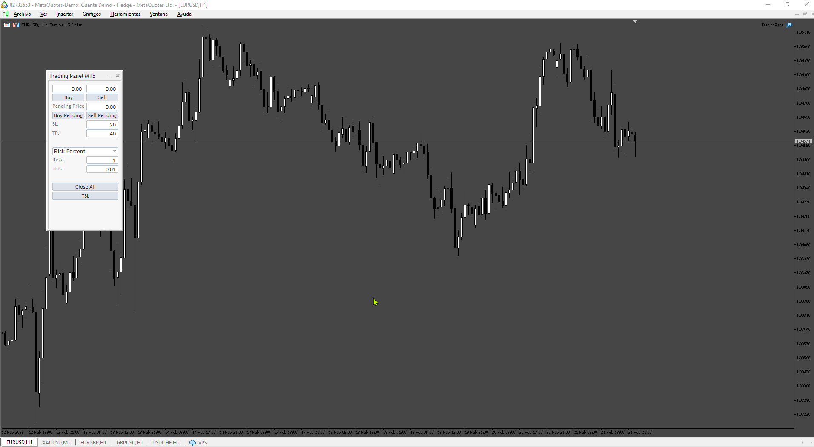
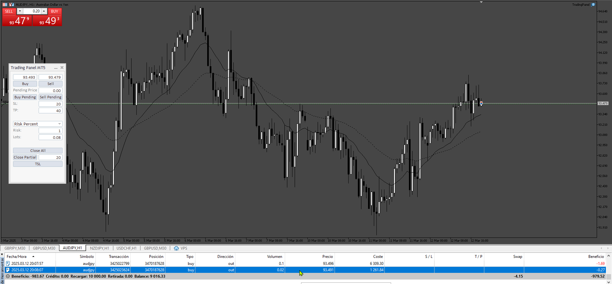
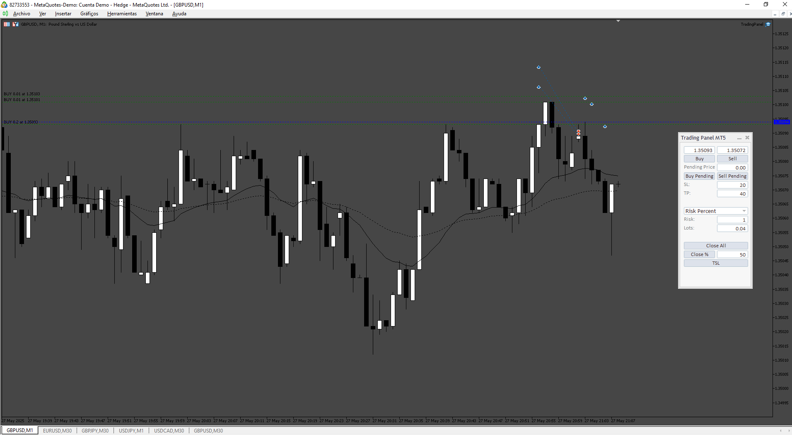

# TradingPanel

> Source: https://fxcodebase.com/code/viewtopic.php?f=38&t=75631  
> Forum: 38 · Topic 75631 · 10 post(s)

---

## TradingPanel

**Apprentice** · Wed Feb 19, 2025 7:08 am

Based on the request.
[https://fxcodebase.com/code/viewtopic.php?f=38&t=75601](https://fxcodebase.com/code/viewtopic.php?f=38&t=75601)

 [TradingPanel.mq5](files/158319/TradingPanel.mq5)

---

## Re: TradingPanel

**fsmith** · Fri Feb 21, 2025 1:53 pm

Great! is posible to add this:
button close all = close all trades in chart
button Trailing stop = trail stop of all traades

great job

---

## Re: TradingPanel

**Apprentice** · Sat Feb 22, 2025 5:26 am

We have added your request to the development list.
Development reference 130

---

## Re: TradingPanel

**Apprentice** · Mon Feb 24, 2025 5:51 am

 [TradingPanel.mq5](files/158381/TradingPanel.mq5)

---

## Re: TradingPanel

**fsmith** · Tue Mar 04, 2025 8:20 am

cool thanks!
New Feature:
. Button to close partial: with a field to the user enter a percent to close

---

## Re: TradingPanel

**Apprentice** · Mon Mar 10, 2025 2:56 pm

We have added your request to the development list.
Development reference 185

---

## Re: TradingPanel

**Apprentice** · Sun Mar 16, 2025 2:13 pm

 [TradingPanel.mq5](files/158642/TradingPanel.mq5)

---

## Re: TradingPanel

**fsmith** · Wed May 21, 2025 7:49 am

I usually enter the market in 3 or more parts to put a trade.
Could you make the panel show me a line with the average price of my entries?
Thanks.

---

## Re: TradingPanel

**Apprentice** · Sat May 24, 2025 2:47 pm

We have added your request to the development list.
Development reference 352

---

## Re: TradingPanel

**Apprentice** · Thu May 29, 2025 11:31 am

 [TradingPanel.mq5](files/159400/TradingPanel.mq5)
