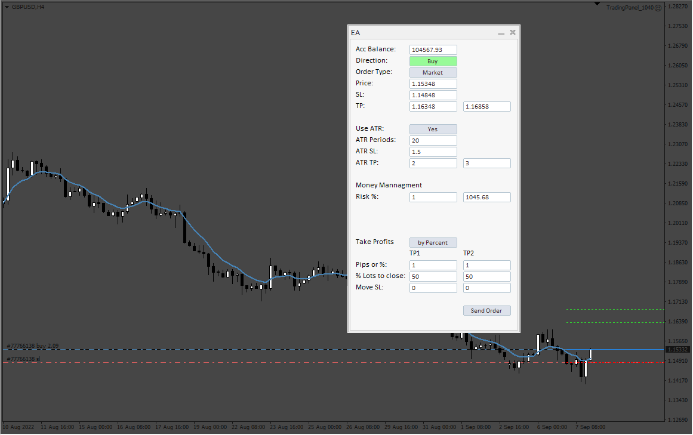
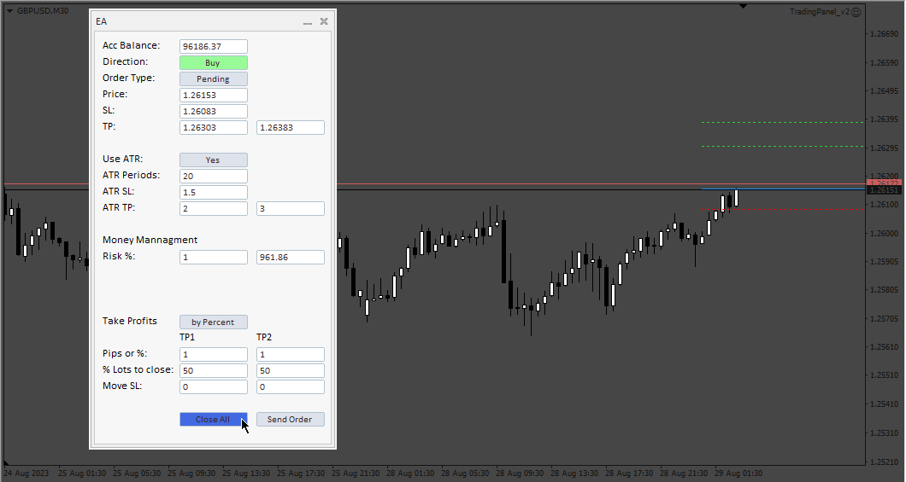

# TradingPanel

> Source: https://fxcodebase.com/code/viewtopic.php?f=38&t=72704  
> Forum: 38 · Topic 72704 · 4 post(s)

---

## TradingPanel

**Apprentice** · Thu Sep 08, 2022 1:31 am

Based on the request.
[https://fxcodebase.com/code/viewtopic.php?f=27&p=144580](https://fxcodebase.com/code/viewtopic.php?f=27&p=144580)

 [TradingPanel.mq4](files/147384/TradingPanel.mq4)

---

## Re: TradingPanel

**Frans88** · Tue Aug 15, 2023 6:14 pm

can you add close all order button? and modification so that this EA works on all time frames, I have tried it but can't open orders on the M1 and M5 time frames, if you use M15 new orders open

---

## Re: TradingPanel

**Apprentice** · Wed Aug 16, 2023 2:32 pm

We have added your request to the development list.
Development reference 715.

---

## Re: TradingPanel

**Apprentice** · Fri Sep 01, 2023 2:28 pm

 [TradingPanel_v2.mq4](files/152343/TradingPanel_v2.mq4)
