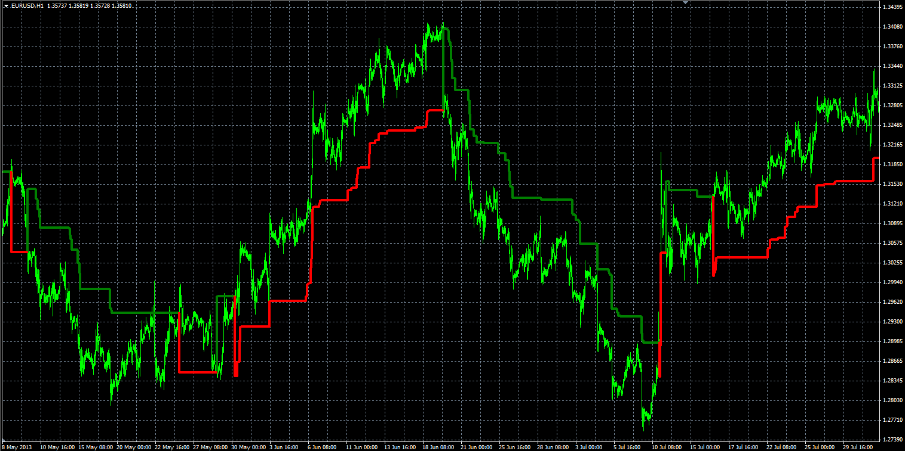

# Trailing Stop level indicator

> Source: https://fxcodebase.com/code/viewtopic.php?f=38&t=59632  
> Forum: 38 · Topic 59632 · 1 post(s)

---

## Trailing Stop level indicator

**Alexander.Gettinger** · Wed Oct 09, 2013 11:31 am

The indicator can be used to calculate the stop levels for trading.

Formulas:
TSL[i] = Max(TSL[i-1], Close[i]-loss), if Close[i]>TSL[i-1] and Close[i-1]>TSL[i-1],
TSL[i] = Min(TSL[i-1], Close[i]+loss), if Close[i]<TSL[i-1] and Close[i-1]<TSL[i-1],
TSL[i] = Close[i]-loss, if Close[i]>TSL[i-1],
TSL[i] = Close[i]+loss, if Close[i]<TSL[i-1], where
loss = Close[i]*Percent/100.

 

Download:

 [Trailing_Stop_Level.mq4](files/89914/Trailing_Stop_Level.mq4)
