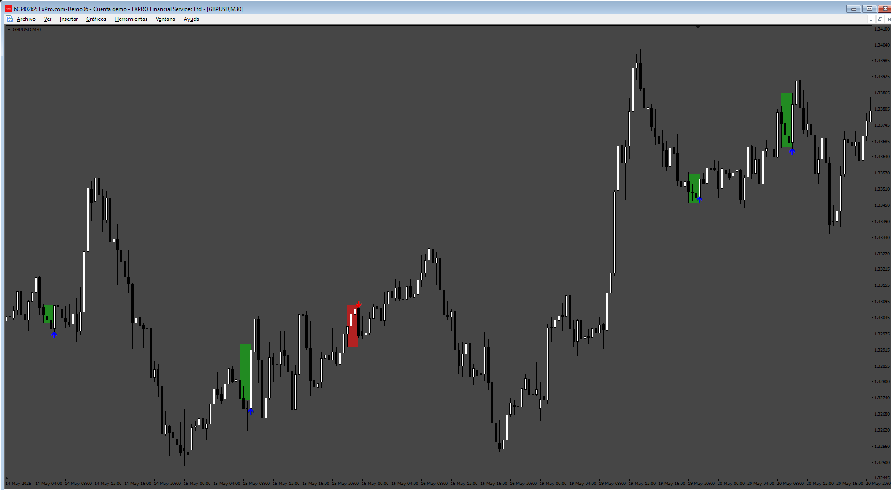

# Tree Line Strike

> Source: https://fxcodebase.com/code/viewtopic.php?f=38&t=76106  
> Forum: 38 · Topic 76106 · 4 post(s)

---

## Tree Line Strike

**Apprentice** · Sun Jun 29, 2025 2:24 pm

Based on the TS2 indicator.
[https://fxcodebase.com/code/viewtopic.p ... 65#p159665](https://fxcodebase.com/code/viewtopic.php?f=17&p=159665#p159665)

 [TreeLineStrike.mq4](files/159787/TreeLineStrike.mq4)

---

## Re: Tree Line Strike

**khanatd** · Tue Oct 21, 2025 1:02 am

hi sir plz add mt4 non repaint arrows at close of current candle or reversals/continuations /breakouts etc

thanks
khan

---

## Re: Tree Line Strike

**Apprentice** · Tue Oct 21, 2025 9:37 am

We have added your request to the development list.
Development reference 677

---

## Re: Tree Line Strike

**Apprentice** · Sat Oct 25, 2025 11:45 am

[TreeLineStrike_Arrows.mq4](files/161048/TreeLineStrike_Arrows.mq4)
