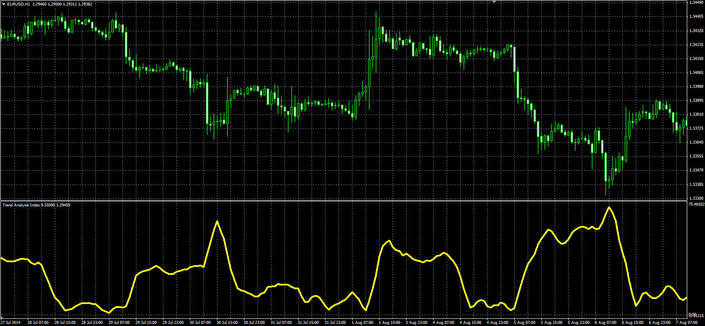

# Trend Analysis Index

> Source: https://fxcodebase.com/code/viewtopic.php?f=38&t=61156  
> Forum: 38 · Topic 61156 · 1 post(s)

---

## Trend Analysis Index

**Alexander.Gettinger** · Mon Sep 15, 2014 12:37 pm

Original LUA oscillator: [viewtopic.php?f=17&t=32941](https://fxcodebase.com/code/viewtopic.php?f=17&t=32941).

Formula:
TAI[i] = (MA_Max-MA_Min)/Price, where
MA_Max, MA_Min - maximum and minimum values of MA at range from (i-TAI_Length+1) to (i),
MA = MA(Price) with [MA_Length] number of periods and [MA_Method] type.

 

Download:

 [TAI.mq4](files/95909/TAI.mq4)
