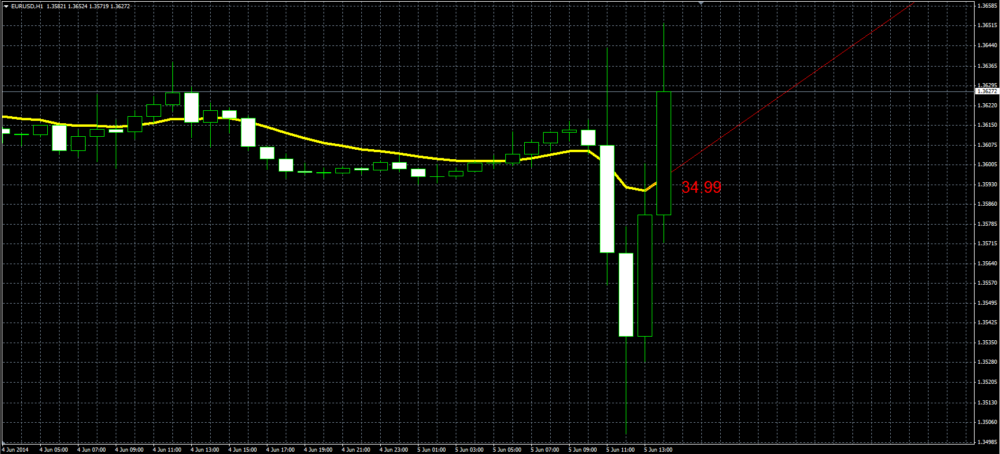

# Trend Angle indicator

> Source: https://fxcodebase.com/code/viewtopic.php?f=38&t=60781  
> Forum: 38 · Topic 60781 · 7 post(s)

---

## Trend Angle indicator

**Alexander.Gettinger** · Thu Jun 05, 2014 9:58 am

Original LUA indicator: [viewtopic.php?f=17&t=60698](https://fxcodebase.com/code/viewtopic.php?f=17&t=60698).
The indicator calculates the slope of the last section of the moving average.

 

Download:

 [Trend_Angle.mq4](files/94336/Trend_Angle.mq4)

---

## Re: Trend Angle indicator

**maciel7000** · Thu Apr 02, 2020 5:41 pm

Dear Mr Alexander Gettinger. Congratulations on your work and your team here developed helping people. On my computer the indicator "Trend Angle.mq4" works fine, but often freezes needing me "reset" to get back up and running. You can help me solve this. In advance my thanks.

---

## Re: Trend Angle indicator

**maciel7000** · Thu Apr 02, 2020 5:49 pm

Dear Mr Alexander Gettinger. I forgot to ask you something about "Trend Angle.mq4". It will be possible to set an alarm when the line is at a certain angle, for example... angle => +50 degrees triggers alarm. Angle <= - 50 ( <=130) triggers alarm. In advance thank you for your time and work

---

## Re: Trend Angle indicator

**Apprentice** · Fri Apr 03, 2020 5:39 am

Your request is added to the development list.
Development reference 1004.

---

## Re: Trend Angle indicator

**maciel7000** · Fri Apr 03, 2020 11:09 am

> **Apprentice wrote:**
> Your request is added to the development list.
> Development reference 1004.

---------------------------------------

Dear Mr Apprentice. Thank you very much for the response and for the excellent work of your team in favor of the international trade community.

---

## Re: Trend Angle indicator

**Apprentice** · Tue Apr 07, 2020 5:21 am

[Trend_Angle.mq4](files/132618/Trend_Angle.mq4)

Try this version.

---

## Re: Trend Angle indicator

**maciel7000** · Mon Oct 19, 2020 9:39 am

> **Apprentice wrote:**
>
>
> Trend_Angle.mq4
>
>
> Try this version.

Thank you very much. Excellent job.
