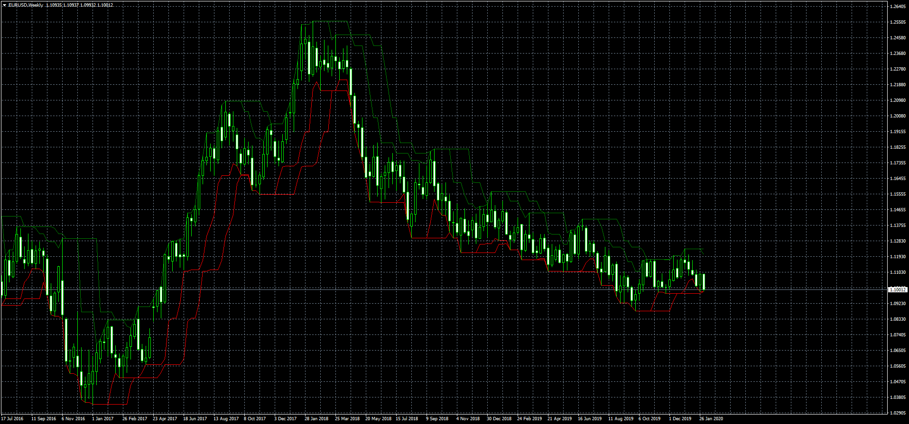

# Trend Bands

> Source: https://fxcodebase.com/code/viewtopic.php?f=38&t=69392  
> Forum: 38 · Topic 69392 · 1 post(s)

---

## Trend Bands

**Apprentice** · Thu Feb 06, 2020 9:16 am

Based on TS2/Lua Indicator.
[viewtopic.php?f=17&t=69360](https://fxcodebase.com/code/viewtopic.php?f=17&t=69360)
Based on the article How To Teach A Turtle To Trade, A Spreadsheet For A
Trend-Following Approach by Ron McEwan, February 2020 issue of S&C magazine.

 [Trend Bands.mq4](files/131139/Trend%20Bands.mq4)
