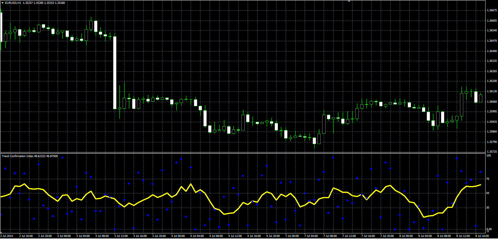

# Trend Confirmation Index

> Source: https://fxcodebase.com/code/viewtopic.php?f=38&t=61051  
> Forum: 38 · Topic 61051 · 1 post(s)

---

## Trend Confirmation Index

**Alexander.Gettinger** · Mon Aug 18, 2014 2:09 pm

Original LUA oscillator: [viewtopic.php?f=17&t=60136](https://fxcodebase.com/code/viewtopic.php?f=17&t=60136).

Formula:
RCI = MA(Raw), where
Raw = 100*(Close-Low)/(High-Low),
MA - moving average with [Method] as type and [Length] as number of periods.

 

Download:

 [TCI.mq4](files/95423/TCI.mq4)
