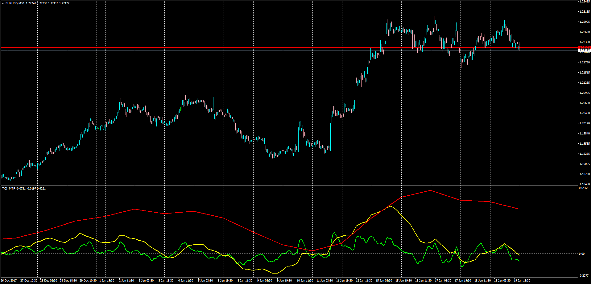

# Trend Confirmation Indicator TCI MTF

> Source: https://fxcodebase.com/code/viewtopic.php?f=38&t=65657  
> Forum: 38 · Topic 65657 · 1 post(s)

---

## Trend Confirmation Indicator TCI MTF

**Apprentice** · Mon Jan 22, 2018 4:56 am

LUA Original: [viewtopic.php?f=17&t=3447](https://fxcodebase.com/code/viewtopic.php?f=17&t=3447)

Description:

MT4 version of the LUA Original "Trend Confirmation Indicator", this time, developed to display 3 timeframes in the same chart.

The TCI is defined as ratio of a short term SMA of the price and a long term SMA,
TCI[period] = (ShortMVA[period] / LongMVA[period]-1) *100;

 [TCI_MTF.mq4](files/117174/TCI_MTF.mq4)
