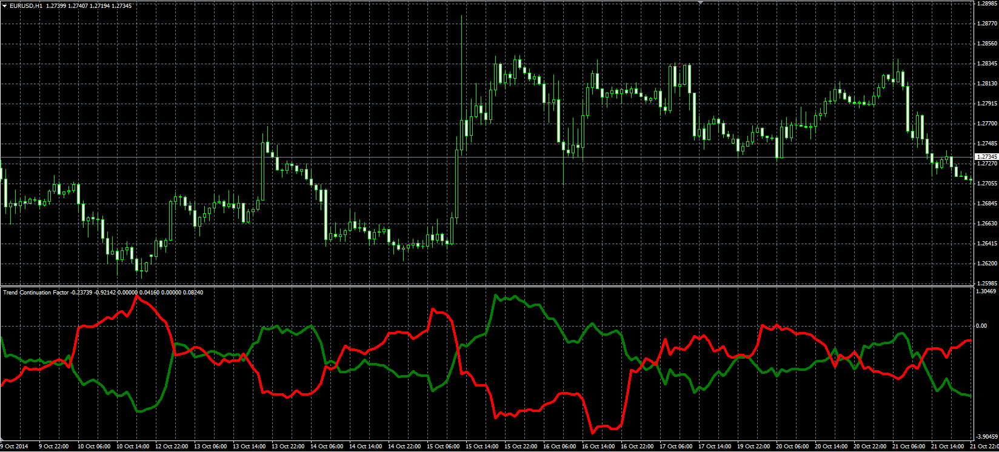

# Trend Continuation Factor

> Source: https://fxcodebase.com/code/viewtopic.php?f=38&t=61447  
> Forum: 38 · Topic 61447 · 1 post(s)

---

## Trend Continuation Factor

**Alexander.Gettinger** · Mon Nov 17, 2014 4:46 pm

Original LUA oscillator: [viewtopic.php?f=17&t=23551](https://fxcodebase.com/code/viewtopic.php?f=17&t=23551).

Formulas:
PTCF = Sum_PC - Sum_NCF,
NTCF = Sum_NC - Sum_PCF, where
Sum_PC - sum of PC at range from (i-Length+1) to (i),
Sum_NCF - sum of NCF at range from (i-Length+1) to (i),
Sum_NC - sum of NC at range from (i-Length+1) to (i),
Sum_PCF - sum of PCF at range from (i-Length+1) to (i),
PC = ROC, if ROC>0, else PC = 0,
NC = -ROC, if ROC<0, else NC = 0,
PCF[i] = PCF[i-1]+ROC, if ROC>0, else PCF[i] = 0,
NCF[i] = NCF[i-1]-ROC, if ROC<0, else NCF[i] = 0,
ROC[i] = 100*(Price[i]-Price[i-CP_Length])/Price[i-CP_Length].

 

Download:

 [TCF.mq4](files/97112/TCF.mq4)
