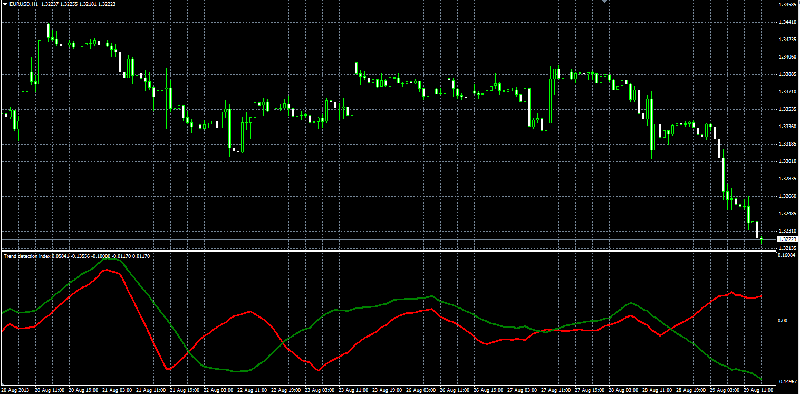

# Trend Detection Index

> Source: https://fxcodebase.com/code/viewtopic.php?f=38&t=59345  
> Forum: 38 · Topic 59345 · 1 post(s)

---

## Trend Detection Index

**Alexander.Gettinger** · Thu Aug 29, 2013 10:42 am

Original LUA oscillator: [http://fxcodebase.com/code/viewtopic.ph ... 3811572bd4](https://fxcodebase.com/code/viewtopic.php?f=17&t=59268&sid=ddd942ccbe6591a28909b33811572bd4).

Formulas:
Direction[i] = Sum(Mom) from (i-Length+1) to (i),
TDI[i] = F+H-G, where
Mom[i] = Price[i]-Price[i-Length],
F = Abs(Direction),
H = Sum(Abs(Mom)) from (i-Length+1) to (i),
G = Sum(Abs(Mom)) form (i-2*Length+1) to (i).

 

Download:

 [TDI.mq4](files/89002/TDI.mq4)
