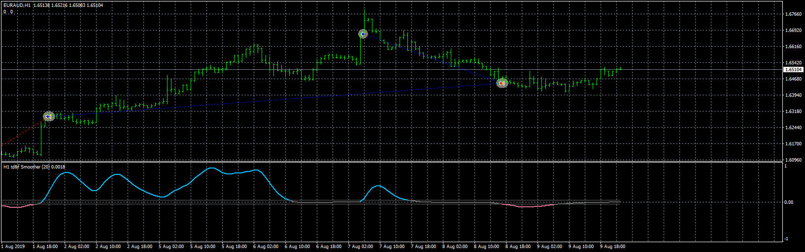

# Trend_direction_&_force_index_EA

> Source: https://fxcodebase.com/code/viewtopic.php?f=38&t=71397  
> Forum: 38 · Topic 71397 · 2 post(s)

---

## Trend_direction_&_force_index_EA

**Apprentice** · Wed Aug 04, 2021 1:47 pm

Based on the request.
[https://fxcodebase.com/code/viewtopic.php?f=27&p=143071](https://fxcodebase.com/code/viewtopic.php?f=27&p=143071)

 [Trend direction & force index - averages alerts 2.mq4](files/143098/Trend%20direction%20force%20index%20-%20averages%20alerts%202.mq4)

 [Trend_direction_&_force_index_EA.mq4](files/143098/Trend_direction__force_index_EA.mq4)

---

## Re: Trend_direction_&_force_index_EA

**twofan7980** · Thu Aug 05, 2021 7:23 am

Dear coder, thank you very much for such a quick response. It's more than what I wanted.
Thank you a thousand times.
