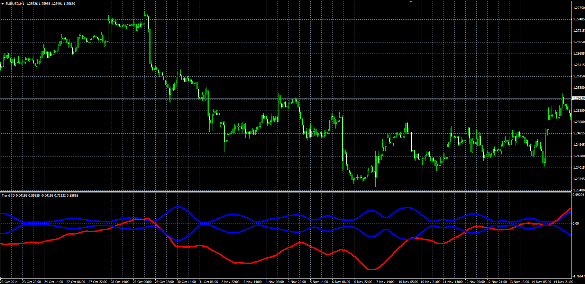

# Trend ID

> Source: https://fxcodebase.com/code/viewtopic.php?f=38&t=61497  
> Forum: 38 · Topic 61497 · 1 post(s)

---

## Trend ID

**Alexander.Gettinger** · Thu Nov 20, 2014 10:26 am

Original LUA oscillator: [viewtopic.php?f=17&t=8114](https://fxcodebase.com/code/viewtopic.php?f=17&t=8114).

> This indicator, as far as I know does not exist anywhere else.
> Was developing in the last few days here on Fxcodebase.
> By Aprentice and Zmender.
>
> The main purpose of this indicator is to distinguish trending from non trending period.

 

Download:

 [Trend_ID.mq4](files/97229/Trend_ID.mq4)
