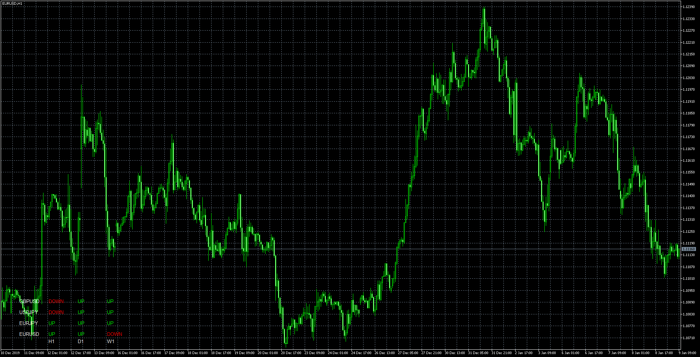

# Trend_indicator

> Source: https://fxcodebase.com/code/viewtopic.php?f=38&t=69302  
> Forum: 38 · Topic 69302 · 4 post(s)

---

## Trend_indicator

**Apprentice** · Thu Jan 09, 2020 4:22 am

Based on request.
[viewtopic.php?f=27&t=69279](https://fxcodebase.com/code/viewtopic.php?f=27&t=69279)

 [Trend_indicator_LuXingMod_AUD.mq5](files/130643/Trend_indicator_LuXingMod_AUD.mq5)

 [Trend_indicator_LuXingMod_AUD.mq4](files/130643/Trend_indicator_LuXingMod_AUD.mq4)

---

## Re: Trend_indicator

**INNOCENT-S** · Fri Jan 10, 2020 11:11 pm

hi, con we have the indicator in MQL4

---

## Re: Trend_indicator

**Apprentice** · Sat Jan 11, 2020 7:11 am

Your request is added to the development list.
Development reference 538.

---

## Re: Trend_indicator

**Apprentice** · Mon Jan 13, 2020 6:27 am

MQ4 version added.
