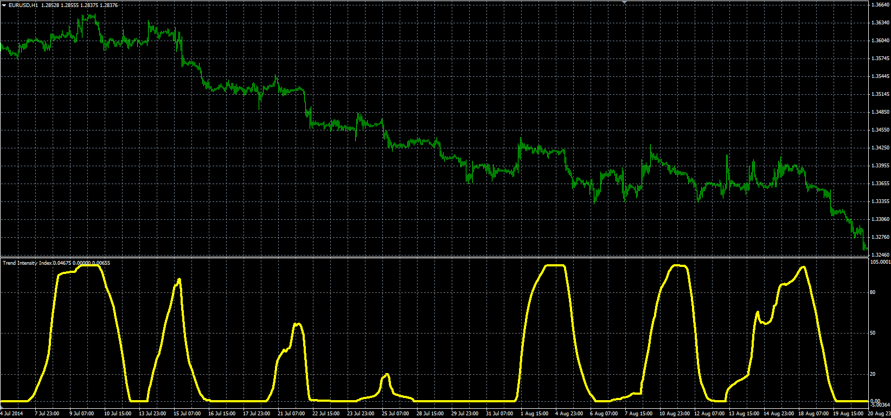

# Trend Intensity Index

> Source: https://fxcodebase.com/code/viewtopic.php?f=38&t=61215  
> Forum: 38 · Topic 61215 · 1 post(s)

---

## Trend Intensity Index

**Alexander.Gettinger** · Mon Sep 22, 2014 10:43 am

Original LUA oscillator: [viewtopic.php?f=17&t=28055](https://fxcodebase.com/code/viewtopic.php?f=17&t=28055).

> Trend Intensity Index (TII) is based on an article by M. H. Pee that is available in the June 2002 issue of Stocks and Commodities Magazine.

 

Download:

 [TII.mq4](files/96075/TII.mq4)
