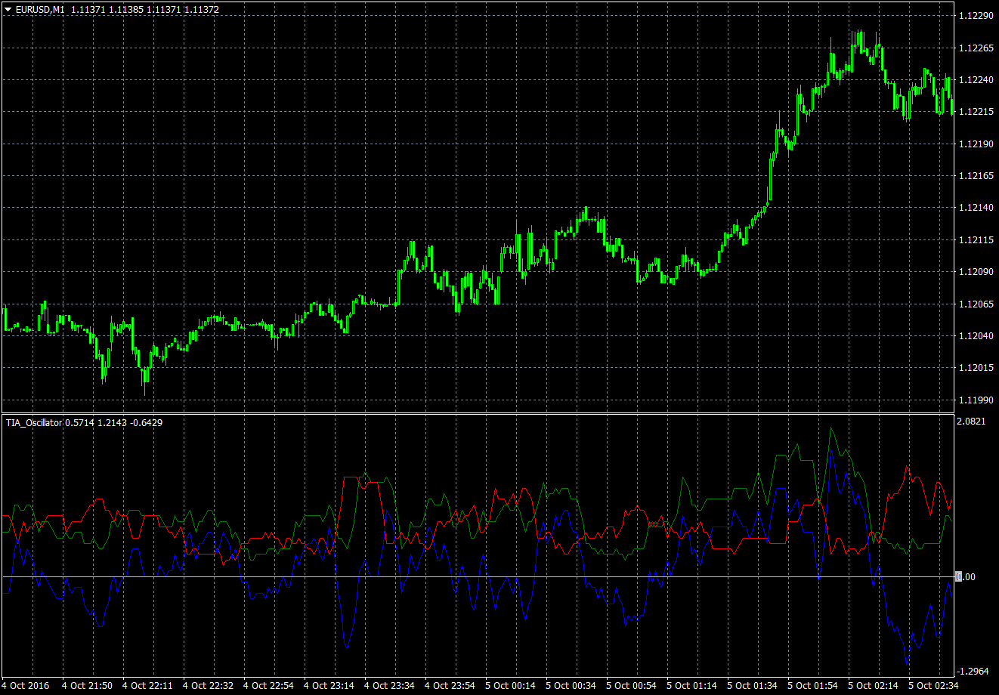

# Trend Interruption Average

> Source: https://fxcodebase.com/code/viewtopic.php?f=38&t=63942  
> Forum: 38 · Topic 63942 · 1 post(s)

---

## Trend Interruption Average

**Apprentice** · Fri Oct 07, 2016 6:59 am

Lua Original
[viewtopic.php?f=17&t=59851&hilit=Trend+Interruption+Average](https://fxcodebase.com/code/viewtopic.php?f=17&t=59851&hilit=Trend+Interruption+Average)

 [TIA.mq4](files/108462/TIA.mq4)

 [TIA with Normalization.mq4](files/108462/TIA%20with%20Normalization.mq4)
